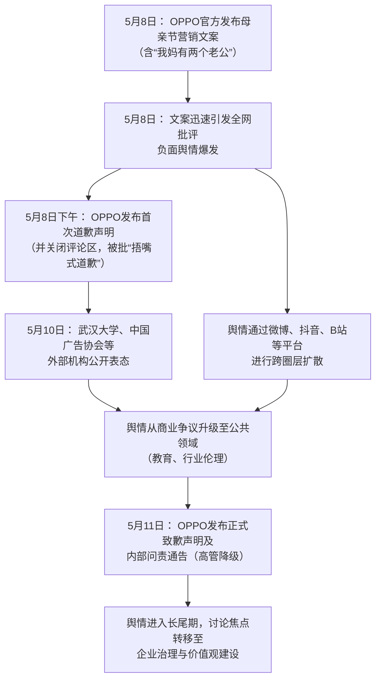

  

# **OPPO母亲节营销文案事件深度分析研报**

  

## **一、 事件概述**

2026年5月8日（母亲节前夕），OPPO官方在微博及小红书发布Find X9系列手机营销文案，其中“我妈有两个‘老公’，一个是我爸，另一个一年见两回……她恨不得穿婚纱”的表述引发广泛争议。该事件在抖音、B站、微博等多平台产生大量讨论，其中B站平台可量化样本包括7条相关视频、361条弹幕及1035条评论。基于对公开社媒语料的分析，**负面情绪（愤怒、批评、嘲讽）占据绝对主导**，占比估算超过85%，主要围绕文案“价值观扭曲”、“冒犯家庭伦理”及企业“捂嘴式道歉”展开。事件最终以OPPO发布严厉内部问责通告（高管降级）暂告段落，但品牌形象遭受深度损伤。

  

## **二、 事件时间线与因果链条**

以下为基于证据池梳理的事件关键节点与发展脉络。

  

  

**图表说明：**

- **首次出处与扩散**：争议文案首发于OPPO官方微博/小红书（证据池：大众日报报道）。负面反应首先于微博、新闻客户端评论区爆发（证据池：历史讨论记录）。

- **关键转折点**：OPPO关闭评论区的“捂嘴”操作（证据池：商业佬视频描述），以及武汉大学（证据池：四川观察视频）、中国广告协会（证据池：红星新闻视频）的机构发声，是舆情从商业批评升级为涉及公共价值观讨论的关键节点。

- **最终处理**：OPPO于5月11日发布的内部问责通告（证据池：九派新闻、IT之家报道）是对事件的最高规格企业回应，其“史上罕见严厉的处罚力度”本身构成了事件的最终事实结论。

  

## **三、 核心矛盾拆解**

**矛盾双方**：OPPO品牌方 vs. 公众（以普通网民及家庭价值观维护者为主）。

  

1.  **品牌方核心诉求（及背后的策划逻辑）**：

    - **诉求**：通过“打破刻板印象”，展现“更多元、更立体的当代母亲形象”（如追星、穿婚纱见偶像），为产品注入话题与关注度。

    - **证据原文**：“我们的创作初衷，是希望打破刻板印象，呈现更多元、更立体的当代母亲形象”——来源：OPPO首次道歉声明。

  

2.  **公众方核心诉求**：

    - **诉求**：维护朴素的家庭伦理与亲情关系的严肃性，反对在公共营销中“扭曲亲情”、“低俗玩梗”。

    - **证据原文**：“完全不考虑妈妈们的感受，把女性物化成只能围绕丈夫和孩子转的附属品，恶心。”——来源：微博评论（历史讨论记录）。 “问题的关键是‘追星’不是‘母亲’的内涵”——来源：B站弹幕。

  

3.  **冲突不可调和性与深层背景**：

    - **存在不可调和的冲突**。品牌方试图将亚文化圈层（饭圈）内部的“玩梗”与“情感表达”方式（如称偶像为“老公”）解构并移植到普世家庭伦理的叙事中，旨在“破圈”。而公众视此为对婚姻忠诚、家庭结构的冒犯与轻佻化，触碰了社会共识的底线。

    - **深层背景**：反映了**营销行业追求“破圈”流量与公众坚守基本伦理底线之间的根本矛盾**。同时，也暴露了**亚文化（饭圈）内部用语与公共话语体系之间的巨大鸿沟**，当后者强行进入前者领域时，必然引发系统性反弹（证据池：抖音视频“爱迫降空城维兰德”分析）。

  

## **四、 信息环境与情绪分布**

**数据来源说明**：以下情绪分布基于B站平台抓取的361条弹幕及1035条评论进行人工编码分析，平台数据摘自《社媒情绪切片报告》。

  

| **平台** | **有效样本量** | **主要情绪分布（估算占比）** | **环境特征分析** |

| :--- | :--- | :--- | :--- |

| **B站** | 弹幕：361条 评论：1035条 | **愤怒与批评**（主导，约50%） **嘲讽与戏谑**（高频，约30%） **困惑与不解**（中等，约15%） **反思与担忧**（较少，约5%） | 情绪激烈且具创造性（如创造“双卡双dad”等梗）。存在**被淹没的理性声音**（如用户“是陆陆陆大叔呀”指出互联网放大效应）。讨论深度较高，延伸至饭圈文化、家庭伦理等层面。关键意见领袖（UP主）的分析视频定调了事件解读方向。 |

| **抖音** | 46个视频（评论抓取失败） | **（基于视频描述）批评与定性**（占绝对主导） | 媒体与商业评论类账号主导舆论定性，用语正式且直接（如“价值观不正”、“史上罕见严厉处罚”）。情绪集中体现为对事件的官方叙事定调。 |

| **微博/新闻客户端** | （无法精确量化，基于历史记录） | **愤怒批评**（主导）、**要求问责** | 热搜机制推动事件快速扩散。主流媒体（人民日报、澎湃新闻等）介入，提升了事件的正式性与严肃性，引导舆论向企业责任与价值观追问发展。 |

  

**关键分析**：

- **情绪煽动者**：文案本身即是最大的“情绪煽动源”。部分二次创作的讽刺性梗图（如“双卡双dad”）虽为戏谑，但也进一步固化了负面印象。

- **KOL角色**：B站UP主、新闻媒体扮演了**事件解读者与定性者**的角色。他们的分析将单点文案失误，引申至企业价值观、审核机制、圈层文化等更深层讨论。

- **理性声音**：存在但音量极小。部分用户尝试从“梗文化破圈失败”、“网络放大效应”等角度进行讨论（证据池：B站用户“是陆陆陆大叔呀”），但被主流批判声浪迅速淹没。

  

## **五、 社会背景与深层病灶**

1.  **集体焦虑的触碰**：

    - **家庭价值观的守护与挑战**：事件发生在结婚率、生育率持续受关注的背景下，“两个老公”的表述极易被解读为对婚姻神圣性与家庭稳定性的调侃，触动了社会对家庭根基问题的敏感神经。

    - **营销的伦理边界焦虑**：在流量至上的环境下，公众对品牌为博眼球不断突破底线的行为早已积怨。此次事件成为集中宣泄的出口，反映了对“无底线营销”的普遍厌倦与警惕。

    - **公共话语“玩梗”泛化的忧虑**：担忧网络亚文化的解构性语言（如“玩梗”）无限制地侵入公共生活领域，导致严肃议题被娱乐化，基本伦理被消解（证据池：B站评论“我们有朴素的伦理道德……梗也会变成新时代的伦理道德的，悲哀”）。

  

2.  **暴露的长期问题**：

    - **品牌营销创意审核的伦理缺失**：事件暴露了企业营销部门内部可能存在“为创意而创意”、脱离社会伦理考量的审核漏洞，以及对不同圈层文化公共化风险的评估不足。

    - **危机公关的“捂嘴”思维依然存在**：首次回应即关闭评论区，显示部分企业面对舆情时，仍将“控制声量”置于“真诚沟通”之上，此操作被普遍视为二次伤害，加剧不信任。

    - **网络“责任泛化”机制成熟**：舆论迅速从文案追责到策划人个人，再关联至其母校武汉大学（证据池：弹幕“又是武大？”），显示出网络问责的“连坐”倾向，迫使非直接责任方（如高校）被动卷入，增加了社会运行的摩擦成本。

  

## **六、 结论与演化推演**

**核心问题与分歧**：本次事件的核心问题在于，**一个商业品牌试图将特定圈层内部的亚文化表达（饭圈“玩梗”），未经伦理过滤地投射到普罗大众的公共情感叙事（母亲节）中，从而引发了价值观层面的剧烈冲突**。分歧在于，一方视之为对多元文化的表达尝试，另一方则视之为对主流家庭伦理的冒犯。

  

**事实呈现的后续影响**：

1.  **对企业的影响**：OPPO通过极高规格的内部问责（证据池：段要辉职级直降两级）展示了纠错决心，并承诺“重构内容审核流程”。但这是否能转化为公众可感知的、长期的价值观践行，尚需观察。品牌美誉度的修复将是一个长期过程。

2.  **对公共讨论的影响**：事件强化了公众对于营销内容应遵守基本社会伦理的共识，并推动了行业监管机构（中国广告协会）的明确表态。同时，也再次将“网络言行边界”、“亚文化与主流文化融合”等议题置于讨论中心。

3.  **对关联方的影响**：武汉大学等教育机构因历史关联被卷入，促使其迅速发声划清界限。这反映了在高度关联的现代社会中，机构声誉面临的复杂外部性风险。事件客观上也引发了对“高学历与高伦理”之间关系的公众讨论。

  

**（报告结束）**