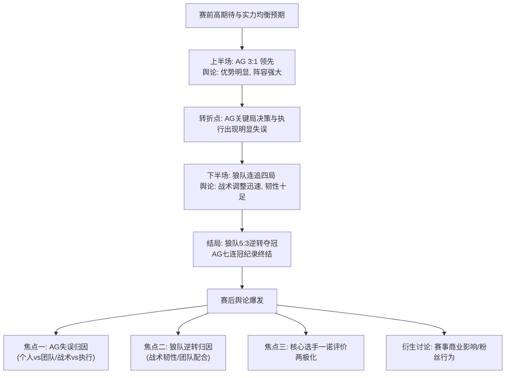

# 2026王者荣耀挑战者杯决赛（AG vs 狼队）舆情深度剖析研报

## 一、事件概述

2026年5月23日，重庆狼队在王者荣耀挑战者杯决赛中，于上半场1:3落后的绝境下，连追四局，以5:3逆转战胜成都AG超玩会，夺得队史第11冠。本次赛事因极具戏剧性的逆转过程及核心选手表现，在社交媒体及游戏社区引发广泛讨论。从证据池中抓取的B站弹幕、评论及抖音评论等文本数据来看，舆论整体情绪呈显著分化：一方面集中于对AG在巨大优势下“崩盘”的失望、愤怒及技术性质疑，情绪强度高；另一方面则是对狼队韧性逆转的赞赏与惊讶。媒体舆论则主要聚焦于赛事的戏剧性与战术层面，基调较为中性客观。本次讨论涉及赛事结果、战术BP、选手表现、粉丝互动及商业联想等多重维度，形成了复杂的情绪与信息交织的舆论场。

## 二、事件时间线与逻辑链条

**图表说明**：

1. **事件起点**：赛事开始前，基于双方历史战绩（AG此前有“七连冠”纪录，狼队为强力挑战者），舆论存在均衡的实力预期与高关注度。
    
2. **关键转折节点**：下半场开始后，AG在BP阵容被普遍认为占优的情况下，未能将优势转化为胜利。B站弹幕高频出现的“彷徨？”、“少人？”以及针对具体团战的质疑（如“清清传送结束了一秒后道仔才二技能了”、“这波一诺早来一点...但来的太晚了”），构成了舆论分析中认为的“失误爆发期”。这一过程是情绪从“期待”转向“失望与困惑”的主要转折点。
    
3. **信息扩散与固化路径**：比赛结果确定后，信息迅速沿两个主要路径扩散：
    
    - **主流媒体/官方路径**：央视体育、中国新闻网等使用“惊天翻盘”定性，聚焦于狼队的体育精神与赛事精彩度。
        
    - **社媒/社区路径**：B站、抖音等平台的弹幕、评论区迅速成为情绪宣泄与技术辩论的主战场，围绕“失误细节”和“选手表现”形成碎片化、高强度讨论。知乎等平台则沉淀了部分战术分析内容。
        
4. **舆论固化**：随着时间推移，讨论焦点逐渐固化为“AG因自身失误痛失好局”与“狼队凭韧性完美逆袭”两大对立又交织的叙事，并深度关联到对核心选手一诺的个人评价上。
    

## 三、核心矛盾拆解

**矛盾双方**：本次舆论的核心矛盾并非简单的队伍粉丝对立，而是 **“期待AG达成历史性成就的观众/粉丝”** 与 **“赛事结果呈现的客观事实（狼队逆转）”** 之间的冲突。具体表现为AG支持者内部及旁观者对“失利原因”的归因分歧。

### 双方核心诉求

1. **诉求方（期待AG取胜的群体）**：渴望对“优势局被逆转”这一令人难以接受的结果获得合理、具体的解释，以消解困惑与失望情绪。
    
    - 诉求体现：“ag这阵容我都不知道怎么输”——B站视频1弹幕。此言论反复出现，代表了观众基于赛前分析和游戏理解，对结果“不可思议”的认知，本质是寻求“为何会输”的答案。
        
2. **事实呈现方（赛事结果与狼队表现）**：需要被承认的是，狼队通过临场调整和强大执行，实现了比赛规则允许范围内的胜利。
    
    - 诉求体现：“狼队在战术层面的针对性调整”——知乎深度分析；央视体育评价狼队展现了“在绝境中不放弃、快速调整的能力”。这些声音代表了对竞技体育中“韧性”与“调整能力”价值的肯定。
        

### 矛盾不可调和性与深层背景

归因分歧表面上看是关于战术失误的讨论，但深层是电竞观众 **“认知模型”与“比赛现实”** 之间的冲突。观众倾向于通过阵容强度、经济差等“硬指标”预测结果，当比赛进程（尤其在高压下）出现不符合模型预测的走向时（如优势方执行变形、劣势方超常发挥），会引发强烈的认知失调。这种失调需要通过归因（是AG打得太差，还是狼队打得太好？）来缓解，从而形成舆论拉锯。这背后是电竞赛事高度竞技化、专业化后，观众深度参与分析与赛事不确定性之间的永恒张力。

## 四、信息环境与情绪分布

|平台|有效样本量估算|积极情绪占比|消极情绪占比|中性/困惑情绪占比|核心讨论焦点|
|:--|:--|:--|:--|:--|:--|
|**B站**（弹幕/评论）|>100条文本|约30%|约50%|约20%|1. **AG具体操作失误**（一诺掉点、清清传送、团队“少人”、“彷徨”）2. **阵容优势未兑现**3. **对狼队表现的赞赏**|
|**抖音**（评论）|较少|约20%|约40%|约40%|1. **结果带来的即时情绪反应**（“这谁绷得住”）2. 对选手（尤其一诺）的简短评价或调侃|
|**知乎**（深度分析）|少量|约60%|约10%|约30%|1. **战术与BP深度复盘**2. 狼队战术针对性的赞扬3. 相对理性的技术讨论|
|**主流媒体**（新闻报道）|多篇|约70%|<5%|约25%|1. **赛事精彩度与戏剧性**2. 狼队的“韧性”与体育精神3. AG一诺里程碑与遗憾并存|

### 环境分析

1. **情绪煽动者与理性声音**：社媒（尤以B站弹幕为典型）存在大量情绪化、碎片化的质疑与指责，构成舆论场的高声部。但其中也夹杂了被“淹没”的、更聚焦游戏本身的技术性讨论（如“这波要是果断点直接大闪是不是更好”、“大招用来跑路，不用拆火?”）。这些理性声音是理解真实观赛体验的重要部分，但被情绪表达所稀释。
    
2. **关键意见领袖（KOL）角色**：证据池显示，部分KOL（如“树叶”）的言论（“AG今天输的太耻辱了”）被用作视频标题，起到了放大情绪、引导话题的作用。专业解说（如瓶子）的评论则被媒体引用，代表了业内相对宏观、正面的评价视角。KOL在分化舆论、提供情绪标签和专业视角两方面均发挥了重要作用。
    
3. **情绪与信息交织**：观众情绪并非凭空产生，而是紧密依附于对具体比赛信息的解读。例如，“少人？”这一高频疑问弹幕，既是困惑情绪的体现，也包含了对团战信息处理、观赛体验与解说同步性的潜在不满。
    

## 五、社会背景与深层病灶

1. **集体焦虑的触碰**：本次事件触碰了当下电竞观众，特别是AG粉丝群体的深层焦虑——**对竞技状态稳定性与偶像“神话”破灭的焦虑**。AG的“七连冠”纪录构建了“王朝”的叙事，此次失利象征着这一叙事的中断。观众对优势局崩盘的激烈反应，部分源于对“确定性”（基于阵容、历史表现的预期）被“不确定性”（比赛实际进程）击碎时的应激反应。
    
2. **暴露的领域问题**：
    
    - **观赛认知门槛与情绪化表达**：高竞技水平的比赛衍生出复杂的战术博弈，但大部分观众仍倾向于通过直观的“人头”、“经济差”判断局势，当局势反复时易产生“看不懂→质疑选手/队伍”的认知捷径。社区文化鼓励短平快、情绪化的表达（如弹幕梗），进一步加剧了讨论的碎片化。
        
    - **核心选手的过度聚焦与“神化”风险**：一诺作为明星选手，其个人表现被置于放大镜下审视，无论是里程碑成就还是关键失误，都承受了远超普通队员的赞誉与批评。这暴露了电竞造星机制下，选手个人与团队成绩高度捆绑所带来的巨大舆论压力。
        
    - **商业叙事与竞技叙事的初步融合**：弹幕中出现的“海信这次没打广告亏麻了/赚麻了”等评论，表明部分观众已将赛事结果与商业赞助进行关联联想，反映了电竞赛事深度商业化后，观众认知维度正在拓展。
        

## 六、结论与演化推演

### 核心问题与分歧

本次赛事舆论的核心问题是 **“如何为一场预期之外的逆转胜利进行归因”**。分歧集中于两点：

1. **责任归属**：是AG主动“犯错”葬送好局，还是狼队被动“抓住”机会实现翻盘？证据池中既有指向AG具体选手和团队操作的“失误论”，也有强调狼队战术调整和执行力的“胜利论”。
    
2. **价值评判**：是更应遗憾于AG“浪费”优势，还是更应赞赏狼队“创造”奇迹？这体现在对AG的失望情绪与对狼队的赞赏情绪之间的拉锯。
    

### 客观呈现的后续影响讨论

根据现有证据池，关于后续影响的讨论已初现端倪：

- **对战队与选手的影响**：AG官方回应“会认真审视不足”。这表明战队层面已进入赛后复盘阶段。舆论对一诺的两极化评价可能持续影响其个人商业价值与心理状态，但业内声音（如解说瓶子）也肯定了其职业生涯的总体高度，形成一定对冲。
    
- **对赛事叙事的影响**：狼队的“第十一冠”和“惊天翻盘”已成为本次赛事的标志性叙事，可能被载入KPL历史。而AG的“七连冠终结”与本次“优势局被逆转”也将成为其队史的一部分，影响未来的粉丝心态与队伍形象。
    
- **舆论演化趋势**：在情绪高峰过后，讨论可能逐渐向两个方向沉淀：一是更深入的战术复盘分析（知乎等平台）；二是转化为对AG战队未来表现的持续性关注或调侃素材。赛事“商业影响”的讨论维度若得到更多信息刺激，也可能进一步发展。
    

（注：本报告基于现有证据池进行分析，所有结论均源自提供的材料，未作超出证据的主观预测。）