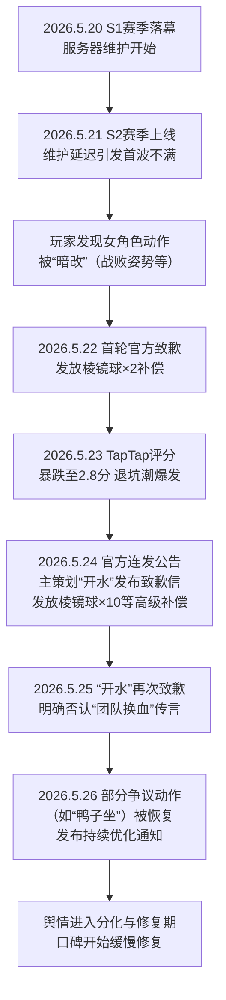

  

## 一、事件概述

  

2026年5月下旬，腾讯旗下经典IP游戏《洛克王国》因S2赛季版本更新，引爆了一场大型玩家信任危机。事件直接导火索为官方对女性角色部分动作（如战败姿势、“鸭子坐”）进行了未提前公告的“暗改”，此举被玩家视为对知情权的侵犯，并引发了对官方决策逻辑（是否为迎合特定群体）的强烈质疑。叠加S2版本本身存在的多项技术性问题（如内存泄漏、精灵蛋资质错误）与糟糕的官方初期应对，玩家愤怒情绪在B站、抖音等平台迅速扩散，导致游戏TapTap评分暴跌至2.8分，出现大规模退坑、停氪行为。核心样本量（B站6个核心争议视频的弹幕评论与抖音1个高争议视频的100条评论）显示，玩家整体情绪极性以**愤怒（对暗改）、不信任（对官方）、失望（对品质）**为主，社区内部亦出现显著分裂与疲惫感。

  

## 二、事件时间线

  

  

**时序图说明：**

- **首次爆发与扩散**：事件始于5月21日S2版本上线后，玩家在社区内率先发现并传播“暗改”事实，关键发声点为B站用户“伊白狐officail”（“暗改的事只字不提”）及抖音用户“玛卡巴卡”（“用的内测包”）。扩散路径从核心游戏社区（B站游戏区、TapTap）迅速蔓延至抖音等泛娱乐平台。

- **官方应对与转折**：5月22日的首轮补偿（棱镜球×2）因被质疑“堵嘴”而适得其反，成为矛盾激化的转折点。5月24日主策划“开水”的致歉信及大幅提升的补偿是官方第二次正式回应，承认了决策失误。5月25日对“团队换血”传言的明确澄清，是针对社区猜测的直接回应，但未能完全平息猜疑。

- **情绪缓解与分化**：5月26日部分争议动作的恢复，是官方对核心玩家诉求的实质性让步，标志着对抗烈度下降，事件进入长尾修复阶段。

  

## 三、核心矛盾拆解

  

**矛盾双方：玩家群体 vs. 《洛克王国》官方运营团队**

  

| 诉求方 | 核心诉求 | 证据池原文依据 |

| :--- | :--- | :--- |

| **玩家** | 1. **对“暗改”行为的解释与程序正义**：要求官方承认并保证未来不再发生未经公告的隐蔽修改。 | “暗改的事只字不提，太抽象了，这次能暗改，下次也能暗改”——B站评论 |

| | 2. **明确官方决策的动机与优先级**：质疑修改是否源于响应了“特定群体”而牺牲核心玩家体验。 | “魔方辱男和媚女权，这是原则问题”——B站评论；“保证不要再把性别叙事带进游戏里”——B站评论 |

| | 3. **对补偿逻辑的质疑**：要求补偿针对核心问题（信任与体验），而非被视为“封口费”或“福利”。 | “微信公众号把补偿宣传成福利”——B站评论；“补偿两个球一根项链什么意思？”——抖音评论 |

| | 4. **对团队稳定性的知情权**：希望了解版本质量下滑是否与团队结构变动有关。 | “空降领导，要给团队内部大换血”——抖音评论 |

| **官方** | 1. **平息风波，稳定玩家情绪与用户留存**：通过多轮高价值补偿与道歉，阻止退坑与口碑持续恶化。 | 事实时间线显示发放了总价值约两个648的补偿。 |

| | 2. **解释失误原因，将问题定义为“技术性/管理性”**：将事故归因于“响应过快”、“版本带病上场”的执行失误，而非主动的价值观迎合。 | 主策划致歉信：“团队严重急于…响应用户反馈，导致优化决策过快…匆忙进入修改”。 |

| | 3. **澄清非组织性变动，维护运营稳定性形象**：直接否认“换血”传言，将问题锁定在原团队执行层面。 | “没有换血，没有空降，没有幕后团队，搞出问题的人就是原团队自己”——主策划“开水”致歉信。 |

| | 4. **恢复部分内容，展示倾听姿态**：回调部分争议动作，以示对玩家诉求的回应。 | 事实时间线显示“鸭子坐”于5月26日被恢复。 |

  

**矛盾性质与背景**：双方诉求存在**不可调和的程序性冲突**。玩家要求的是“透明”与“尊重”，即决策过程的参与感和知情权；官方回应的核心是“结果”与“稳定”，即通过资源补偿和事后调整来平息事态。这背后是**游戏行业长期存在的“开发者-玩家”权力不对等关系**，以及移动互联网时代玩家社群意识觉醒、对“暗箱操作”容忍度急剧下降的深层行业背景。官方将补偿宣传为“福利”的举动，被玩家解读为“傲慢”，进一步撕裂了信任基础。

  

## 四、信息环境与情绪分布

  

| 平台 | 有效样本量（概估） | 核心情绪分布（基于语料高频词与内容分析） | 环境特征分析 |

| :--- | :--- | :--- | :--- |

| **B站** | 6个核心视频的弹幕与评论（数千条） | **愤怒/批判（60%）**：集中于“暗改”、“不透明”、“媚女权”等关键词。 **失望/嘲讽（25%）**：对补偿、游戏质量的讽刺（“堵嘴的”、“草台班子”）。 **理性/疲惫（15%）**：存在呼吁区分“正常发声”与“引战”、建议冷静思考的声音。 | **关键意见领袖（KOL）角色复杂**：部分UP主制作分析视频，成为情绪放大器和信息整合节点（如“黑椒糖唯酢”相关视频）。同时，用户自发区分“冲锋派”与“串子”，表明社区具有一定的自我净化意识，但极端情绪言论更易传播。 |

| **抖音** | 1个高争议视频的100条最新评论 | **愤怒/质疑（70%）**：直接质问补偿内容、质疑团队变动（“空降领导”）。 **玩梗/自嘲（20%）**：“小丑赛季”、“织梦醒了”等黑色幽默。 **其他（10%）**：关联其他游戏（如《原神》）的评论。 | 传播更侧重于情绪化、碎片化的质问和玩梗。**存在“情绪煽动者”**，如发布“空降领导”传言的抖音用户“天已黑”、“哈哈哈猫太”，其未经证实的言论被广泛引用，加剧了猜疑。理性声音在该平台相对更弱。 |

  

**环境分析总结**：舆情呈现出典型的**“沉默的螺旋”与“群体极化”**并存特征。主张对“暗改”强烈抗议的声音形成了主流舆论场，将事件与“性别议题”、“公司文化”等更深维度挂钩。而呼吁回归游戏体验、对官方处理节奏持相对理解态度的“理性声音”（如B站用户“20077困”、“你的永久呵”）被淹没。**外部煽动者（“串子”）** 利用核心矛盾，以更极端言论（如全盘否定团队）混入讨论，客观上加速了情绪极化和社区撕裂。

  

## 五、社会背景与深层病灶

  

1.  **玩家知情权与程序正义的集体焦虑**：本次事件触碰了当下游戏玩家（乃至互联网用户）对“透明度”日益增长的刚性需求。在付费服务、数字产品领域，用户对“你改了我的东西，却偷偷不告诉我”的行为容忍度极低，认为这侵犯了其作为消费者的基本权利。

2.  **性别议题在泛娱乐领域的敏感性**：事件中“女角色动作修改”被迅速与“性别叙事”、“迎合特定群体”绑定。这反映了当前互联网环境中，任何涉及性别表现的内容都极易触发广泛的社会讨论和立场站队，游戏厂商在此领域操作面临极高的舆论风险。

3.  **“长青游戏”运营模式的信任危机**：《洛克王国》作为拥有大量低龄及休闲用户、生命周期长的“长青游戏”，其此次危机暴露了一个行业性问题：**如何在用户群体多元、诉求日益分化的环境下，建立可持续的、可信的版本更新与沟通机制**。依赖临时性、高成本的“补偿”来修复信任，而非建立制度化的透明流程，终将难以为继。

4.  **“草台班子”叙事下的管理性质疑**：玩家对版本质量下滑（技术BUG、彩蛋缺失）的愤怒，与“用内测包”、“团队混乱”等猜测结合，形成了对项目组专业能力的“草台班子”叙事。这背后是玩家对大型游戏公司项目管理能力下降的普遍性担忧。

  

## 六、结论与演化推演

  

**核心问题与分歧**：事件的核心问题并非游戏内容修改本身，而是**修改过程的不透明性（程序失当）** 与**官方危机应对的优先级错位（沟通失效）**。分歧在于，官方将事件定性为一次“技术性”、“响应过度”的运营失误，而相当一部分玩家则认为这是“价值观”、“决策权”层面的原则性背叛。这种对事件性质认知的根本差异，是信任难以快速修复的主因。

  

**后续影响（基于证据池讨论）**：

1.  **对玩家行为的影响**：部分玩家因补偿和动作回调选择回流，但“下次还敢”的疑虑普遍存在于社区讨论中，长期付费意愿和对版本更新的期待值可能受损。

2.  **对官方运营的约束**：事件迫使官方在后续运营中需极度谨慎地对待任何涉及外观、文化的修改，并建立更完善的公告机制。“给所有长青游戏上了一课”的媒体评价，预示着此事件将成为行业参考案例。

3.  **对社区生态的影响**：事件加剧了核心玩家社区内部的分裂与不信任感，短期内“串子”、“引战”等扰乱秩序的行为可能更易被触发。社区管理的复杂性显著提升。

4.  **对产品生命周期的潜在影响**：此危机对《洛克王国》IP的口碑构成了显著冲击。其长期影响取决于官方能否在后续多个版本中，通过持续、稳定的优质内容和真诚透明的沟通，系统性重建信任，而非依赖一次性的资源倾斜。