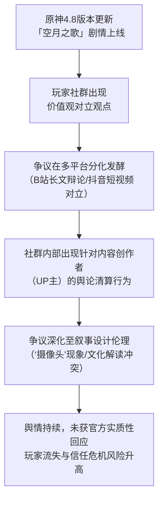

---

  

## 一、事件概述

本次舆情源于《原神》4.8版本“空月之歌”剧情中，对角色“散兵”（流浪者）的“洗白”叙事引发的大规模玩家争议。事件在B站、抖音等平台引发深度辩论，讨论样本量涵盖大量视频、评论与弹幕。舆情呈现显著的多极化特征，整体情绪以负面与质疑为主导，但存在基于不同哲学与文化框架的辩护与支持声音。核心冲突集中于对“洗白”定义、角色道德评判标准、叙事节奏合理性及玩家代入感削弱等层面，矛盾激烈且尚未收敛。

  

## 二、事件时间线与逻辑演进

  

**逻辑演进说明：**

1.  **触发点**：争议始于游戏新版本剧情的公开体验（证据池-弹幕：“顺序反了，先去把赎罪剧情做了”）。

2.  **对立形成**：玩家迅速分化为基于不同价值体系的阵营（证据池-B站用户“迷胡聋冻”提供佛教解读 vs 弹幕“以德报怨，何以报德？”的儒家/现实道德反驳）。

3.  **扩散与复杂化**：争议从剧情讨论蔓延至对游戏公司叙事意图的批评（证据池-视频标题“堪比《高尔夫2》的圣母剧情”）及社群内部权力动态（证据池-B站用户“华为原神”提及“清算up”）。

4.  **核心暴露**：讨论揭示了玩家对“玩家代入感”被削弱的深层不满（证据池-弹幕“高情商：见证者 低情商：摄像头”），这是比角色好恶更根本的情绪焦点。

5.  **风险状态**：舆情处于持续发酵且缺乏官方针对性引导的状态，风险维持高位。

  

## 三、核心矛盾拆解

**矛盾双方**：反对“洗白”的玩家群体 与 支持/中立解读的玩家群体（及隐含的游戏公司叙事意图）。

  

| 阵营 | 核心诉求 | 关键证据引用 |

| :--- | :--- | :--- |

| **反对方** | 1. **坚持现实道德标准审判**：反对以任何理由模糊角色过往罪行。 | “以德报怨，何以报德？以直报怨，以德报德！”——弹幕 |

| | 2. **要求叙事逻辑自洽与顺序合理**：认为“赎罪”情节应先于角色地位提升展现。 | “顺序反了，先去把赎罪剧情做了”——弹幕 |

| | 3. **维护玩家主体性**：不满主角在关键剧情中被边缘化。 | “高情商：见证者 低情商：摄像头”——弹幕 |

| **支持/中立方** | 1. **基于文化/哲学框架提供解读**：为角色转变寻找非“洗白”的叙事逻辑。 | “我更倾向于佛教中的放下屠刀，立地成佛的感觉……不是立马变成佛！”——B站用户“迷胡聋冻” |

| | 2. **基于游戏设定与长线运营辩护**：接受“人偶”非人设定及“伏笔论”。 | “他必须要存在的，毕竟是开服就存在的伏笔”——B站用户“啦啦MJW” |

| | 3. **呼吁给予叙事时间**：相信后续剧情会展现赎罪过程。 | “原神是长线运营的游戏，散的赎罪跟惩罚还没到呢”——弹幕 |

  

**冲突的不可调和性**：双方基于截然不同的价值判断前提（现实道德律令 vs 虚拟世界观设定/长线叙事承诺），且对“何为合格的叙事”有根本性分歧。这并非单纯的观点对立，而是**评估叙事合理性所依据的元规则冲突**。

  

**深层行业/制度背景**：事件暴露了商业游戏在长线运营中面临的固有矛盾：**角色作为商品的“魅力塑造”需求** 与 **作为叙事作品的“道德复杂性”** 之间的平衡难题。当“反派魅力”转化为可抽取角色时，其“洗白”或“救赎”叙事极易被玩家视为服务于商业策略的生硬工具，从而引发叙事信任危机。

  

## 四、信息环境与情绪分布

  

| 平台 | 有效样本特征 | 主要情绪分布 | 关键环境分析 |

| :--- | :--- | :--- | :--- |

| **B站** | 长视频评论区、弹幕。样本量大，讨论深入。 | **负面/质疑（~60%）**：道德愤怒、剧情失望。 **中性/分析（~20%）**：文化解读、设定考据。 **正面/支持（~20%）**：角色欣赏、长线期待。 | **存在情绪煽动者**：如用户“华为原神”煽动对特定UP主的“清算”，推动社群对立标签化。 **存在被淹没的理性声音**：如弹幕“缓刑一种是……”试图进行法律类比分析，以及“他的人生经历已经是最顶格的处罚了”基于设定的辩护，在整体情绪化氛围中易被忽略。 **KOL角色分化**：部分UP主（如解读视频作者）提供分析框架，但易被卷入对立成为情绪标靶。 |

| **抖音** | 短视频描述及标签。样本呈现快节奏、标签化特征。 | **两极化对立**：直接肯定（“洗白很成功”）与尖锐嘲讽（“还在洗散，还真是老谭！”）并存。 | 信息更情绪化、结论先行。深度讨论缺失，但高效传播对立情绪，加速舆情扩散。理性声音更难呈现。 |

  

**分析**：信息环境呈现“深度讨论与情绪宣泄并存，但情绪标签更易传播”的特点。社群内部因观点不同产生新的权力动态（“清算”行为），这本身已成为舆情风险的一部分。被淹没的理性声音（如等待长期叙事、进行法律/哲学类比）代表了部分玩家试图超越即时情绪的努力，但在当前对立环境下，其影响力有限。

  

## 五、社会背景与深层病灶

1.  **集体焦虑触碰点**：

    *   **玩家话语权与代入感焦虑**：“摄像头”指责集中反映了在长线、大型商业叙事中，玩家对自身在故事中主体性被削弱、情感投入不被尊重的普遍焦虑。这超越了单一游戏，触及了互动叙事产品的核心体验矛盾。

    *   **对“价值正确”叙事的不信任**：当复杂的道德议题被呈现时，部分玩家倾向于将其简化为“洗白”或“说教”，反映出对商业作品进行深度价值输出时可能存在的“虚伪”或“功利”意图的高度敏感与不信任。

  

2.  **暴露的领域长期问题**：

    *   **叙事伦理与商业逻辑的冲突**：如何为具有历史罪行的高人气角色设计赎罪弧光，同时满足道德逻辑、叙事艺术和商业价值，是行业长期难题。《原神》此次事件表明，任何一方失衡都可能引发严重反噬。

    *   **社群极化与讨论质量下降**：争议迅速演变为非黑即白的阵营对立，标签化（“洗散”、“老谭”）取代了具体讨论。这暴露了在缺乏有效引导和共识框架下，大型玩家社群自组织讨论易陷入低质量循环的困境。

  

## 六、结论与演化推演

**核心问题与分歧**：

本次舆情的核心是**《原神》试图用一套复杂的、带有东方哲学色彩和长线伏笔设计的叙事逻辑，去重塑一个具有重大道德瑕疵的角色，但未能成功弥合其与广大玩家，特别是秉持朴素现实道德观玩家之间的认知与情感鸿沟**。根本分歧在于评判“救赎”或“洗白”的标准——是即时的道德满足感，还是对复杂叙事设计的耐心与信任。

  

**后续影响的客观呈现**：

1.  **玩家流失风险**：证据池中有直接表述，如用户“缘起原去”描述了从感兴趣到“完全没兴趣”的过程，表明叙事争议已直接导致部分玩家沉浸感丧失与主动流失。

2.  **社群内部净化**：出现了玩家自发对特定内容创作者进行“标记”和“清算”的现象（如针对疑似“敖厂长”小号的言论），这意味着舆情生态已从观点对立延伸至社群内部的权力整肃，加剧了环境的不友好性。

3.  **对后续叙事的信任成本**：无论未来“赎罪”剧情如何展开，此次事件已消耗了大量玩家的信任。官方需要更高超的叙事技巧和更直接的沟通，才能修复此次危机造成的叙事合法性损伤。争议并未结束，而是随着后续剧情更新，进入了更长期的信任观察与验证阶段。