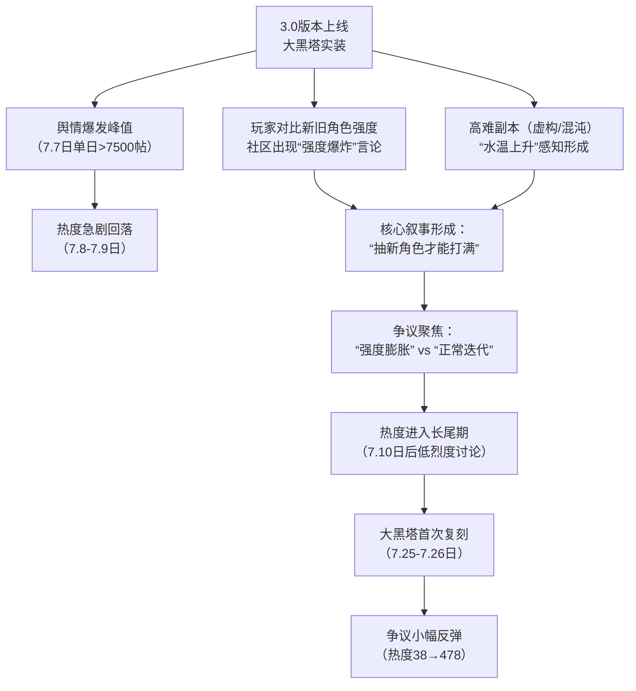

# 《星穹铁道》3.0版本“大黑塔强度膨胀”与“水温上升”争议深度分析研报

## 一、事件概述

本次争议围绕米哈游旗下游戏《崩坏：星穹铁道》3.0版本新上线角色“大黑塔”展开。其强度表现被广泛认为存在数值膨胀，并直接导致游戏内高难周期性内容（如“虚构叙事”“混沌回忆”）难度（玩家称之为“水温”）显著提升。

舆情在版本上线当日（7月7日）集中爆发，单日相关网络讨论帖超过7500条，热度指数接近8000，随后两天内急剧回落。

核心情绪表现为：

- 强度焦虑（约50%）
- 平衡不满（约30%）
- 嘲讽愤怒（约15%）
- 理性讨论与认可（约5%）

事件本质是长线运营游戏中，商业化驱动下的强度快速迭代，与玩家追求角色保值、公平游戏体验之间的固有矛盾在特定版本的集中爆发。

---

## 二、事件时间线

### 图表说明

#### 1. 爆发点与扩散路径

事件以3.0版本更新（含大黑塔上线）为直接触发器，经由B站、抖音等平台的玩家实测视频、攻略及强度对比内容迅速扩散。

关键转折点在于：

- 忘却之庭
- 虚构叙事
- 混沌回忆

等周期性高难副本的难度变化（即“水温上升”）被玩家直观感知，并与新角色强度形成强关联。

最终形成社区主流叙事：

> 不抽新卡则无法舒适通关。

#### 2. 热度变化

争议呈现典型版本驱动型舆情特征：

- 更新节点集中爆发
- 缺乏新刺激后快速降温
- 在角色复刻等消费节点再次回流

---

## 三、核心矛盾拆解

### 矛盾双方

#### （一）主张“强度膨胀 / 水温上升”方

主要为追求进度与强度的玩家。

##### 核心诉求

游戏数值体系迭代过快，导致旧角色与旧队伍快速贬值，被迫持续投入资源抽取新角色应对环境变化，损害长期投入的保值感与策略多样性。

##### 代表观点

> “旧角色彻底淘汰，游戏逼氪意图太明显，水温煮青蛙。”

> “42天膨胀30%。”

> “没有缇宝的大黑塔已经被虚构淘汰。”

---

#### （二）主张“正常迭代 / 可接受”方

主要为部分休闲玩家、XP党以及体验良好的强度党。

##### 核心诉求

角色更新与强度提升属于长线运营的正常商业逻辑，高难内容本就面向追求挑战的玩家。

社区存在过度焦虑。

##### 代表观点

> “大黑塔是新一代人权卡，抽到就是赚到。”

> “我这种强度党其实没感受到什么膨胀。”

> “3.0挂自动随便满。”

---

### 深层冲突

双方核心分歧集中于：

- 强度迭代速度是否合理
- 高难内容是否与新角色强绑定

本质上反映的是：

**短期商业收入最大化**

VS

**长期玩家生态稳定**

之间的经典矛盾。

目前证据显示：

虚构叙事、混沌回忆等终局玩法的环境设计，与大黑塔体系存在明显协同关系。

玩家因此形成认知：

> 强度膨胀正在被转化为实际付费压力。

---

## 四、信息环境与情绪分布

| 平台 | 样本特征 | 情绪分布 | 环境分析 |
|------|----------|----------|----------|
| B站 | 视频、弹幕、评论 | 焦虑/不满60%；嘲讽20%；理性15%；正面5% | 信息密度高，大量伤害测试与实战对比内容 |
| 抖音 | 短视频评论 | 愤怒/嘲讽50%；焦虑30%；调侃15%；正面5% | 情绪表达激烈，极端观点更容易获得传播 |
| NGA/微博等 | 长文讨论 | 不满70%；理性20%；无所谓10% | 更多聚焦机制分析与商业模式批判 |

### 环境总结

当前信息环境呈现明显的情绪极化。

主流情绪包括：

- 规则遵守者吃亏
- 角色投入被背刺
- 强度焦虑持续累积

理性声音虽存在，但整体传播能力较弱。

由于缺乏官方回应，负面叙事占据主导地位。

---

## 五、社会背景与深层病灶

### 1. 集体焦虑

#### 投入价值贬值焦虑

玩家投入大量时间和金钱培养角色，却在短时间内被新体系替代。

典型表达：

> “周年庆氪了快两万，现在感觉背刺了。”

---

#### 资源规划与付费压力焦虑

高难内容与角色强度绑定，使玩家持续处于资源焦虑状态。

形成认知：

> 不抽版本答案就拿不到完整奖励。

---

#### 对“温水煮青蛙”运营的不信任

“水温”成为社区高频词汇。

反映玩家对渐进式提高消费压力的长期警惕。

---

### 2. 暴露的长期问题

#### 强度迭代与角色保值预期冲突

长线数值游戏最核心矛盾。

本次争议的焦点在于：

- 膨胀速度过快
- 环境配合过强

---

#### 深渊类玩法设计僵化

终局玩法奖励与角色销售深度绑定。

容易成为舆情放大器。

---

#### 社区沟通失效

玩家体感与官方表态之间存在明显信息鸿沟。

焦虑情绪只能通过社区内部循环放大。

---

## 六、结论与演化推演

### 核心问题

《星穹铁道》3.0版本的角色强度迭代节奏与环境难度提升幅度，是否已经超出玩家群体的合理接受范围，并构成实质性的消费压力。

目前来看：

**负面感知与焦虑情绪占据社区主导地位。**

---

### 后续影响

#### 1. 玩家行为层面

部分玩家表达：

- 停氪
- 摆烂
- 退游

等倾向。

同时也有玩家选择：

- 跟版本抽卡
- 调整资源规划

以适应当前环境。

---

#### 2. 社区舆论层面

“强度膨胀”“水温煮青蛙”等叙事已经固化。

未来每次：

- 新版本上线
- 新人权卡登场
- 深渊环境调整

都可能重新激活相关争议。

---

#### 3. 长期产品风险

若当前模式持续：

- 玩家长期留存意愿下降
- 付费信心受损
- 社区对强度更加敏感

最终可能形成：

> 依赖强度刺激收入的恶性循环。

---

## 演化推演

未来舆情走势将主要取决于：

### 情绪进一步恶化情景

若：

- 数值膨胀继续加速
- 深渊环境持续绑定新角色
- 官方保持沉默

则下一轮版本更新极可能再次引爆同类争议。

---

### 情绪缓和情景

若：

- 加强旧角色补强
- 提高环境多样性
- 公开设计思路

则争议可能逐步转化为长期存在但相对理性的讨论议题。

---

## 风险评级

**综合风险等级：高**

当前争议已形成稳定负面叙事，并具备在后续版本周期内反复触发的条件。