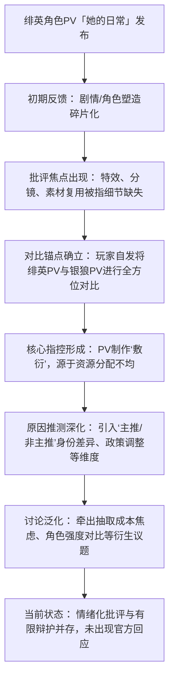

### **一、事件概述**

本次舆情围绕手游《崩坏：星穹铁道》4.2版本角色“绯英”的PV发布展开。玩家社区普遍认为其PV（宣传视频）的制作质量（特效、分镜、叙事）低于预期，尤其是与同期上线的高热度角色“银狼”的PV形成鲜明对比，从而产生“敷衍”定性。舆情样本覆盖B站、抖音、YouTube、NGA、巴哈姆特、知乎等多个平台，有效讨论样本量逾数百条。当前整体情绪以**负面批评为主导**，占比预估超过60%，主要聚焦于制作规格与资源分配不均；同时存在约20%-30%的**中性讨论**（涉及强度、抽取策略）及约10%的**正面辩护**（强调PV的“梗含量”与“产能奇迹”）。

### **二、事件时间线**

**核心争议发展脉络：**

**关键节点说明：**
1.  **首次扩散**：批评最早集中于B站相关视频的弹幕与评论区，随后扩散至抖音、YouTube等平台的评论区及深度讨论社区（NGA、巴哈姆特）。
2.  **转折关键发声**：玩家引用具体证据（如Logo复用“風堇”素材、特效删减对比）并建立“绯英vs银狼”的对比框架后，批评从主观感受上升至基于可观察事实的指控，舆情迅速聚焦。
3.  **扩散路径**：从单一视频平台的吐槽 → 多平台交叉验证与对比 → 社区论坛的深度分析（结合强度、成本、角色定位）→ 对游戏运营策略的普遍性质疑。

### **三、核心矛盾拆解**

**矛盾双方**：批评方（认为PV敷衍的玩家群体） 与 辩护方（认为PV尚可或事出有因的部分玩家及分析者）。

**双方核心诉求与依据：**

| 角色 | 核心诉求 | 依据（证据池原文） |
| :--- | :--- | :--- |
| **批评方** | 1. **要求公平、高质量的制作投入**，反对资源分配不公。 | “预算给银狼让路了”——[B站弹幕]；“给你加了飞叶，特效给足一些，怎么卖狼呢？”——[B站弹幕] |
| | 2. **重视PV的叙事完整性与细节品质**，认为这是对角色的尊重。 | “分镜跳跃”、“特效与变速处理不足”、“素材复用（Logo）”——[舆情与事实分析报告]；“大招开启前还有花的特效吧，这里面一个也没了”——[B站弹幕] |
| | 3. **反对“主推”身份导致的差别化待遇**。 | “黄泉人家是主推啊”；“这又不是主推”——[B站弹幕]；“内部矛盾转外部这一块；不是主推导致连主推一般资源都没有的问题”——[B站弹幕] |
| **辩护方** | 1. **认可PV的娱乐性与“梗”含量**，认为角色塑造达到了目的。 | “梗含量奇高”——[舆情报告引用观点]；PV“梗 >> 剧情节奏”但目的可能在于此。 |
| | 2. **体谅制作组的客观限制**，如工期、政策等。 | 纬相关内容“经历了整体重做”，端出来已是“产能奇迹”——[舆情报告]；“原本是太刀因为国际形势硬改的”——[B站弹幕]；“上面政策要改”——[巴哈姆特评论] |

**冲突分析**：双方诉求存在**根本性冲突**。批评方聚焦于**绝对质量标准与资源分配的公平性**，而辩护方则侧重于**相对价值（娱乐性）与对客观约束的理解**。此冲突背后深层的行业/制度背景是：
1.  **GaaS（游戏即服务）模式下的内容产能压力**：长线运营游戏需持续更新高品质内容，但产能永远有限，导致角色资源投入不可避免地出现优先级排序。
2.  **商业角色定位与玩家情感投入的错位**：厂商基于数据与商业策略定义“主推”，而玩家对所有角色均抱有情感期待与付费意愿，当感知到待遇差异时易产生背叛感。
3.  **外部内容审核的不确定性**：证据中提及的“政策调整”若属实，则意味着开发内容可能面临不可控的后期修改，打乱原有制作节奏，成为“敷衍”的客观诱因之一。

### **四、信息环境与情绪分布**

**各平台有效样本量及情绪分布（基于证据池可获取数据估算）：**

| 平台 | 样本来源/类型 | 预估情绪分布（负面：中性：正面） | 备注 |
| :--- | :--- | :--- | :--- |
| **B站** | 5个高相关视频的弹幕、评论 | 70% : 20% : 10% | 批评声浪最集中，直接对比证据多。 |
| **抖音** | 35个相关视频的描述文本 | 60% : 30% : 10% | 情绪化标题与策略讨论并存。 |
| **YouTube** | 视频评论 | 65% : 25% : 10% | 存在“宣发差距确实大”等对比性批评。 |
| **NGA/巴哈姆特** | 帖子、长文评论 | 60% : 30% : 10% | 深度分析较多，纳入政策、历史对比等维度。 |
| **知乎** | 问答、回答 | 50% : 40% : 10% | “产能奇迹”等辩护观点有一定讨论空间。 |

**信息环境分析：**
1.  **情绪煽动者**：存在。表现为直接使用“敷衍”、“实验品”、“弃子”等定性强烈词汇的用户，以及通过简化对比（如仅比特效时长）放大落差感的内容。
2.  **被淹没的理性声音**：存在但音量较小。例如，讨论“刀型元素因国际形势硬改”的弹幕、理性分析抽取性价比与强度配队的评论（“高金绯樱带记忆低金就打欢愉队”）、以及对疲劳感的表达（“老非酋一样能玩，但是也是真的痛苦”）。
3.  **关键意见领袖（KOL）角色**：主要为游戏攻略、测评类UP主/创作者。他们通过制作详细的**PV对比视频、强度测评**，客观上**巩固了对比框架**，并提供了大量“弹药”（如特效细节缺失的帧级分析），是舆情结构化、论据化的关键推动者。部分KOL的结论（如资源投入拉满）直接成为社区共识。

### **五、社会背景与深层病灶**

本次事件触碰了当下游戏社区，尤其是二次元手游玩家群体的几重**集体焦虑**：
1.  **付费价值焦虑**：在高额抽卡成本（证据中大量“330才01”、“17次歪”等自述）背景下，玩家对角色的全部衍生内容（包括PV）的期待被急剧拉高，任何“缩水”迹象都会被放大解读为对自身投入的不尊重。
2.  **公平感知焦虑**：玩家对“内部黑箱操作”的敏感。当观察到资源明显向某角色倾斜时（“预算给银狼让路了”），容易产生“公司为商业利益刻意区别对待”的猜疑，破坏对游戏公平性的信任。
3.  **表达焦虑与话语权争夺**：玩家希望自己的诉求（如对某个角色的热爱、对公平的渴望）能被开发者“看见”。当感受到常规渠道反馈无效时，会选择在公开社交媒体上以激烈言辞制造声浪。

**暴露的长期问题**：
1.  **角色养成与商业化设计的张力**：游戏需要持续推出新角色驱动收入，但新角色不可避免地会与老角色在资源、强度上产生复杂关系，如何管理玩家预期、平衡新老角色权益是长期挑战。
2.  **内容生产透明度与沟通机制缺失**：在面对可能的工期压力、政策调整等客观困难时，官方缺乏有效的前置沟通渠道，导致玩家只能从成品倒推动机，猜测性、情绪化的解释（如“内部矛盾”）成为主流。

### **六、结论与演化推演**

**核心问题与分歧**：
本次舆情的**核心问题是**：玩家基于可观察的细节差异（特效、分镜、素材），认为绯英PV的制作诚意低于基准（银狼PV），并将其归因于厂商内部的、不透明的资源分配策略（“主推”身份差异）。

**核心分歧在于**：对“敷衍”的归因。批评方认为是**态度问题**（主观选择），而辩护方部分认为是**能力/环境问题**（客观限制）。

**后续影响的客观呈现（基于证据池讨论）**：
1.  **对官方的潜在影响**：证据池显示，此类事件会**消耗玩家信任**，并可能引发对后续新角色PV的“显微镜式”审查。社区中已出现“心里没鬼为啥要改”等质疑，表明信任一旦受损，任何调整都可能被负面解读。
2.  **对玩家行为的影响**：讨论中大量出现“因此决定放弃抽绯英”、“强度都在线，按xp抽即可”等表述，表明舆情可能影响部分玩家的抽取决策，推动其向**更基于个人喜好（XP）而非单纯强度或剧情**的理性消费靠拢。
3.  **社区讨论演化**：当前讨论已从单纯的质量批评，泛化至对**角色强度性价比、抽取策略、未来队伍构建**的综合讨论（如“欢愉售后队友能出三个吗？”）。若无官方回应或版本重大利好转移注意力，关于“资源分配公平性”的质疑可能作为一种潜在情绪，累积并影响未来类似事件的舆论走向。