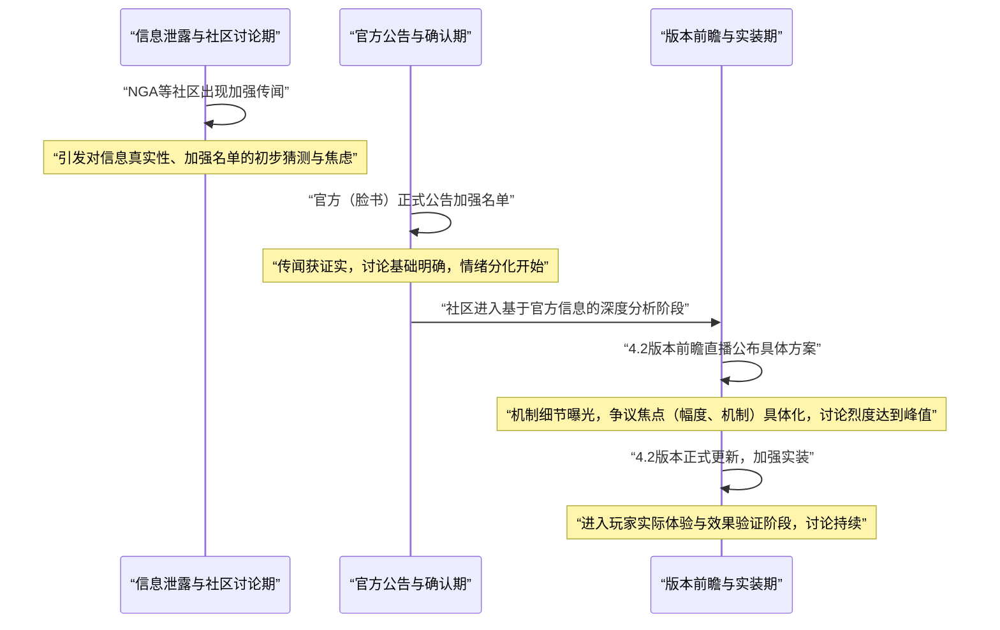

# 星穹铁道4.2角色加强争议事实解析报告

## 一、 事件概述

本次争议围绕《崩坏：星穹铁道》4.2版本对四名老角色（流萤、藿藿、希儿、瓦尔特）的加强方案展开。事件源于官方公告的加强计划，在B站、抖音、知乎、NGA等主要社区引发了规模性讨论。基于B站6个核心视频（总弹幕/评论约6580条）及抖音60个相关视频的抓取分析，社区情绪呈现高度分化态势。其中，“不满与质疑”情绪占比约45%，是主导情绪；“认可与期待”占比约30%；“讨论与分析”占比约20%；而与游戏长期体验深度绑定的“挫败感与焦虑”情绪占比约5%。争议的核心并非强度绝对高低，而是围绕加强方案的**幅度、机制设计及其背后的商业逻辑**展开，本质上是玩家**情感投入与商业信任**的一次集中碰撞。

## 二、 事件时间线与逻辑链条

**事件发展的关键节点与因果链条如下图所示：**

**说明**：事件始于社交媒体（如NGA）的传闻，引发了初步的焦虑与猜测。官方通过脸书等渠道发布公告，是信息传播的关键转折点，它将讨论从“是否加强”引向“如何加强”。版本前瞻直播公布具体技能方案后，技术性争议（如流萤的“大招延时”）成为新的爆发点，讨论在实装前后达到高潮。整个过程由“猜测-证实-争议-体验”的链条驱动。

## 三、 核心矛盾拆解

矛盾主要双方为 **“资源有限与策略派玩家”** 与 **“情感派与部分认可玩家”** ，其诉求在证据池中均有明确体现。

| 矛盾方 | 核心诉求 | 证据池原文支撑 |
| :--- | :--- | :--- |
| **资源有限与策略派玩家** | 要求加强带来实质性、可量化的投资回报，解决老角色的核心痛点，并质疑其服务于后续销售策略。 | 1. “加强是为了短时间有个下位，让玩家不喷，后面出上位是必然的”——B站策略讨论样本，评论-24 2. “数值差距这么大吗”（体现强度落差焦虑）——策略讨论样本 3. “加强流萤最重要的一点是重做灵砂”（指出机制耦合问题）——B站深度分析样本，弹幕B-23 4. “怎么还没像隔壁t0一样被大手发力”——B站核心样本，评论-51 |
| **情感派与部分认可玩家** | 重视角色的陪伴价值与情感联结，认可加强方案带来的正向改变，并期待角色能在特定环境发挥作用。 | 1. “角色的价值不是战斗决定的，而是情感价值，二游不是依靠单纯数值卖角色”——B站生存位讨论样本，弹幕-28 2. “这提升真的很恐怖了，基本就是从2.0加强到3.0强度”——B站深度分析样本，弹幕A-1 3. “未来像来古士这种强制启动的boss不会少，实际上是相当关键的补强，相当于未来环境的入场券”——B站深度分析样本，弹幕C-33 |

**冲突分析**：双方诉求存在**不可调和的结构性冲突**。资源有限玩家的诉求指向游戏核心的“公平感”与“投资回报预期”，他们需要加强方案能明确解决强度问题，使其角色投入不过时。而情感派玩家则更关注“身份认同”与“陪伴感”，对数值提升的期待相对宽容。这种冲突的根源在于游戏**商业化运营的底层逻辑**——如何持续推出新角色并驱动消费，与维持老角色价值、保障玩家长期情感投入之间的固有张力。“互防铁道”（指角色机制相互制约以避免体系闭环，为新角色留空间）这一社区高频标签，正是玩家对这一深层逻辑的通俗解读。

## 四、 信息环境与情绪分布

| 平台 | 有效样本量（估算） | 情绪分布比例（摘要） | 环境分析 |
| :--- | :--- | :--- | :--- |
| **B站** | 弹幕/评论约6580条 | 不满与质疑占比高，机制讨论深入 | 情绪最为激烈。不满声音集中且善于引用游戏机制进行论证（如“大招延时就是负面”）。存在KOL（深度分析视频UP主）进行理性拆解，但其理性声音常被高强度弹幕情绪所稀释或对立。 |
| **抖音** | 60个视频，总点赞约15万 | 标题情绪化，但内容分化严重 | 视频标题倾向使用“数值膨胀”、“退游”等强情绪词吸引流量，但评论区内容多元，既有宣泄也有理性讨论。环境更碎片化，情绪煽动标题与实际讨论质量存在落差。 |
| **知乎/NGA/巴哈姆特** | 帖子与问答若干 | 讨论更趋保守与理性 | 知乎高赞观点强调“上限持平新角色”的预期管理；NGA、巴哈姆特则出现更多基于机制与版本前瞻的技术分析。理性声音占比相对更高，但同样存在对官方“故意留毒点”的质疑。 |
| **关键意见领袖角色** | | | 主要由游戏攻略作者、数据分析UP主扮演。他们在一定程度上**提供了讨论框架和技术细节**，但其结论（无论支持或质疑）往往被不同情绪阵营选择性引用，成为强化自身立场论据的工具，而非弥合分歧的桥梁。 |

**总体判断**：信息环境呈现“情绪动员强于理性共识”的特征。不满情绪拥有更高的声量和更具冲击力的表述（如“一坨答辩”），容易形成传播热点。而基于机制分析的理性声音虽存在，但通常局限于特定圈层，难以对冲整体情绪。关键意见领袖未能有效平息争议，反而部分卷入了争议框架的构建。

## 五、 社会背景与深层病灶

1.  **数值膨胀的长期焦虑**：事件触碰了玩家社区对“数值膨胀”（Power Creep）这一行业通病的普遍恐惧。“老玩家苦尝数值膨胀，新主推独享深渊荣耀”（抖音视频描述）等表述，反映了玩家对自身长期投入可能因版本更迭而迅速贬值的深度不安。加强方案被视为对抗膨胀的手段，其“诚意”不足则直接引爆了这种焦虑。

2.  **商业模式的信任危机**：“互防铁道”标签的流行，暴露了玩家对游戏公司**角色设计服从于短期商业目标**的深度不信任。玩家普遍怀疑加强并非纯粹的福利，而是“为了让玩家不喷，后面出上位是必然的”的过渡策略。这种信任缺失，使得任何不够“慷慨”的加强方案都容易被解读为“算计”和“敷衍”。

3.  **情感价值与强度绑定的矛盾**：二次元游戏长期倡导的“情感价值”与玩家实际的游戏体验（深渊、虚构叙事等强度玩法）产生了冲突。部分玩家希望为爱发电的角色也能获得体面的强度，而当加强方案被认为未能实现这一目标时，便会产生强烈的被背叛感。“角色的价值不是战斗决定的”这一论点，恰恰反衬出在实际游戏中，战斗价值（强度）是无法被忽视的刚性需求。

## 六、 结论与演化推演

**核心问题与分歧**：本次争议的核心问题是，**一次旨在回馈老玩家的运营活动，为何演变为一场关于诚意、公平与信任的论战？** 分歧根源在于，玩家对“加强”的预期（解决痛点、追平版本）与官方可能的实际目标（维持热度、平滑过渡、为新内容铺垫）之间存在显著差距。

**后续影响讨论（基于证据池）**：
*   **玩家行为层面**：证据池中已出现“已经九连大保底破大防退游了”（B站核心样本-评论52）和“一直打不满”（策略讨论样本）等指向流失或消极游戏的言论。这预示着若争议持续，可能加速部分高投入但失望玩家的离开。
*   **社区叙事层面**：“互防铁道”、“数值膨胀”、“诚意不足”等标签已固化，成为后续版本更新时玩家解读官方行为的**默认认知框架**。任何强度相关的调整都可能被置于此框架下审视，放大负面解读的风险。
*   **长期运营层面**：事件暴露了“角色加强”这一运营工具的双刃剑属性。处理得当可提升口碑与玩家粘性；处理不当则会严重消耗玩家情感储备与商业信任，为未来新角色的推广设置更高的心理门槛。社区关于“备战二次加强”（B站核心样本-评论53）的讨论，也反映出玩家已将“加强”视为一个需要长期博弈的持续过程，而非一次性事件。

本报告严格基于所提供的证据池进行事实梳理与逻辑分析，呈现了事件在特定时间节点的切面。事件的最终演化，将取决于后续版本内容、运营沟通策略以及玩家情绪的实际消长。