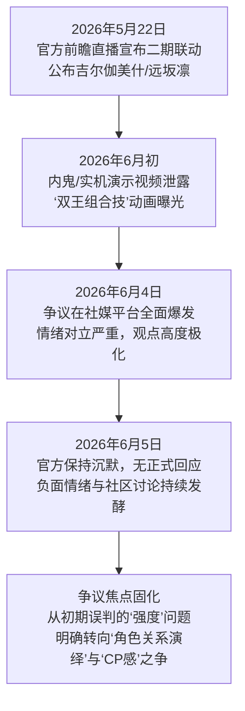

## 一、事件概述
《崩坏：星穹铁道》4.4版本与《Fate/stay night [UBW]》的第二期联动于2026年6月初因实机演示泄露引发广泛争议。争议焦点集中于新实装角色“吉尔伽美什”（金闪闪）与已有角色“Saber”之间的“双王组合技”。核心矛盾并非如早期分析所指向的强度平衡问题，而是**对组合技动画演出中所呈现的角色关系解读**。大量玩家，特别是Fate系列原作核心粉丝，强烈反对将原作中具有明确敌对、压迫性关系的两位角色，通过具有对称性、呼应性的动作设计包装为“CP”或“合作”关系，认为这是对原作人设与关系逻辑的严重扭曲和“消费情怀”。当前社媒舆情中，**反对与质疑情绪占据压倒性优势**（占比预估超过85%），支持与中立声音极为微弱。官方尚未就此次争议发布任何正式说明，其沉默态度进一步加剧了玩家社区的猜测与对立情绪。

## 二、事件时间线

**文字说明**：
*   **初始传播（5月22日）**：官方在版本前瞻直播中正式公布二期联动角色与上线时间，为后续内容埋下伏笔。
*   **争议引爆点（6月初）**：未正式发布前的角色实机演示视频（含组合技动画）在社媒泄露，成为争议的直接导火索。视频中Saber与金闪闪的“联合出场动画”及技能动作设计，被大量玩家解读为官方在刻意“卖CP”。
*   **舆情爆发与固化（6月4-5日）**：争议迅速在抖音、B站、NGA、TapTap等平台蔓延。高赞评论集中于讽刺动画设计如同“敌对互殴”、“背刺”，并强烈反对“卖CP”定性。此时，争议的核心已从游戏机制层面（强度、实用性）彻底转向叙事与情感层面（角色关系、IP精神）。由于官方未作出任何回应，社区对立情绪持续发酵，舆论焦点进一步固化为对官方“改编逻辑”与“消费情怀”的批判。

## 三、核心矛盾拆解
**矛盾主要双方：原作向玩家/核心粉丝 vs. 官方（米哈游）及部分CP党/泛用户玩家。**

*   **反对方（原作向玩家）核心诉求**：
    1.  **维护原作角色关系的严肃性**：要求官方尊重Fate原作中Saber与金闪闪之间明确的敌对与压迫关系设定，反对任何将其“CP化”或“暧昧化”的演绎。
        *   引用证据：“一句话讲明白：金闪闪和 saber 的关系=白厄和来古士”（抖音评论，点赞89）；“saber从头到尾就没笑过，说抄CP的是从哪里看出来的”（抖音评论，点赞219）。
    2.  **反对“人设崩坏”与“消费情怀”**：认为联动内容糅合了多条世界线设定，生硬拼接，破坏了原有人设的完整性与逻辑性，是对角色信仰的背叛。
        *   引用证据：“主要是老米考虑过真喜欢saber的人会想把金闪闪塞saber队伍里看阿尔托莉雅被金皮卡偷袭吗”（抖音评论，点赞19）；“该氪氪，该肝肝”（证据池）的务实态度背后，隐含了对“投入产出”价值落差的不满。
    3.  **质疑设计的合理性与诚意**：认为“组合技”动画演出效果与“合作”定义背道而驰，更像是敌人互打，设计缺乏诚意。
        *   引用证据：“背刺失败硬说是连协技”（抖音评论，点赞97）；“这是组合技吗？这是连saber一起打吧”（抖音评论，点赞94）。

*   **支持方（官方/CP党/部分玩家）诉求（证据池中较弱）**：
    1.  **接受二次创作与改编空间**：认为联动是二创，拥有合理改编的自由，部分玩家接受或欣赏该组合设定。
        *   引用证据：“这才是真正的fate味道，双王同屏，王之宝库配合誓约胜利之剑，演出效果拉满”（历史记录中的早期观点）。
    2.  **关注角色外观与内容体验**：部分玩家更关注角色建模、剧情演出等非关系层面的内容。
        *   引用证据：“其他的不说 这个王之侧颜太美了”（社媒情绪报告）。

**冲突性质**：双方诉求存在**根本性、难以调和的冲突**。反对方的诉求根植于对原IP文化符号、叙事逻辑和情感价值的**捍卫与所有权意识**，属于精神与文化层面的需求。而官方的商业联动行为，从证据池中呈现的结果看，更侧重于**角色外观、技能演出的视觉整合与商业化拓展**，无意或未能充分顾及核心粉丝对角色关系“原真性”的苛刻要求。这种冲突是**IP深度商业化与核心圈层文化认同保护之间的经典矛盾**。

## 四、信息环境与情绪分布

| 平台 | 有效样本特征 | 主导情绪分布（基于高赞/高频评论） | 关键意见领袖/高影响力声音 |
| :--- | :--- | :--- | :--- |
| **抖音** | 评论样本量大，点赞数据直观，情绪表达直接、强烈。 | **反对/质疑 (主导):** 约90%+。集中于讽刺组合技为“敌对互殴”、“背刺”，强烈否认“卖CP”。 **中立/困惑:** 少量。如“没看过fate，这两黄毛是CP吗？”（点赞21）。 **支持:** 极微量。 | 高赞评论用户（如“慕尘”，点赞646）成为反对方的“情绪代言人”，其言论（“差点一箭爆头然后有人跟我说这是调情？”）极大强化了反对叙事的传播。 |
| **B站** | 讨论深度稍强，存在少量理性分析与中间立场。 | **反对/质疑 (主导):** 强烈反对官方设计逻辑，强调原作关系。 **理性中间派 (微弱):** 存在复杂个人感受或对讨论误区的指正，但音量极小，常被淹没。如“仅代表个人吧...承认这是个有独特魅力的角色”（点赞3）。 **机制讨论 (边缘):** 极少量从游戏战斗机制出发的理性探讨，未形成主流。 | 演示视频的弹幕与评论区成为情绪宣泄主战场，理性声音（如对“双王党”内部细分的讨论）生存空间狭窄。 |
| **NGA/贴吧/TapTap** | 核心玩家聚集，讨论更具深度和阵营化。 | **反对/质疑 (绝对主导):** 观点系统化，直接上升到“IP商业化” vs “角色信仰”的冲突高度，讨论人设“缝合感”。 | 社区意见领袖（KOL）的分析文章（如被引用的17173长文）构建了反对叙事的理论框架，将事件定性为“商业破圈”与“核心粉丝”的必然冲突。 |

**信息环境分析**：
*   **情绪煽动者**：反对情绪具有强烈的自传播属性，源于对原作情节的高度共识和情感共鸣。个别极富讽刺性的高赞评论（如抖音上的）起到了“情绪放大器”的作用，迅速凝聚共识，压制了其他理性讨论空间。
*   **被淹没的理性声音**：存在少量试图区分角色个人魅力与CP组合、或从游戏机制本身进行探讨的声音，但在压倒性的反对情绪浪潮中，这些声音影响力甚微，且发表者常需附加“仅代表个人”等免责声明。
*   **关键意见领袖（KOL）角色**：部分KOL和社区深度用户承担了“议程设置”和“理论定调”的功能，他们将具体的设计争议（组合技动画）提升到文化批判层面（IP精神被消费），塑造了此次争议的主导叙事框架，即 **“官方在扭曲原作角色关系以迎合小众CP党”**。

## 五、社会背景与深层病灶
本次争议触碰了以下集体焦虑与长期问题：

1.  **IP深度开发中的文化尊重焦虑**：随着游戏行业进入“IP联动”深水区，玩家（尤其是IP原作粉丝）对商业开发如何“尊重”而非“消费”经典角色、情节和关系的阈值越来越高。此次事件表明，任何可能被解读为 **“魔改”核心关系**的尝试，都极易引爆焦虑。
2.  **“为爱买单”与“规则逻辑”的冲突**：在二次元游戏生态中，玩家为角色投入情感与金钱（“为爱买单”）的前提，是相信官方会维护该角色的内在一致性与独特魅力。当官方的设计被认为违背了角色原有的行为逻辑（如将宿敌强行组合）时，会触发强烈的 **“背叛感”** ，动摇付费的情感基础。
3.  **社群圈层化与话语争夺**：事件清晰展现了“原作党”与“CP党/泛用户”之间的圈层壁垒与话语权争夺。在缺乏官方有效引导和澄清的情况下，社群容易陷入基于不同原作认知的“立场先行”的骂战，而非就事论事的设计讨论。
4.  **官方沟通机制失效的风险**：在争议爆发后，官方的持续沉默被解读为“默认”或“傲慢”，错失了澄清设计意图、安抚核心用户情绪的最佳窗口期。这暴露了在面临高强度、情感化的社区危机时，部分游戏厂商**缺乏敏捷、有效、共情的沟通策略**。

## 六、结论与演化推演
**核心问题与分歧**：
本次事件的核心问题，是《崩坏：星穹铁道》在Fate IP联动中，对Saber与金闪闪“组合技”的**视觉演出设计与叙事暗示**，与Fate核心粉丝群体对**两位角色原作关系严肃性、对立性认知**之间产生了不可调和的冲突。分歧的本质在于：**官方试图进行的“梦幻联动”式二次创作，被核心粉丝解读为对原作文化符号的扭曲和“人设崩坏”**。

**后续影响讨论（基于证据池客观呈现）**：
1.  **社区信任损伤**：证据池显示，反对情绪已从针对单次设计，蔓延至对官方IP运营诚意和角色理解能力的**广泛质疑**。部分玩家开始回溯此前可能存在的类似设计，形成“消费情怀”的连贯叙事。
2.  **商业化预期受挫**：对于吉尔伽美什和远坂凛角色的商业化前景（抽卡意愿），在反对阵营中已产生明确的负面影响。争议本身成为阻碍部分原作粉丝付费的因素。
3.  **官方回应压力持续累积**：在官方持续沉默的背景下，社区猜测和愤怒得不到疏导，可能进一步固化对立情绪，甚至引发针对其他联动内容的连锁审视。未来官方的任何回应，都将面临严格且带有负面预设的审视。
4.  **行业警示**：此次事件已成为一个典型案例，警示所有涉足深度IP联动的游戏厂商：**在商业创意与IP原真性之间寻找平衡时，对原作角色关系、尤其是核心冲突关系的处理必须极度审慎**。将具有严肃张力的关系进行轻佻化、CP化改编，是高风险操作，极易触动核心粉丝的文化守卫本能。

**（报告终）**