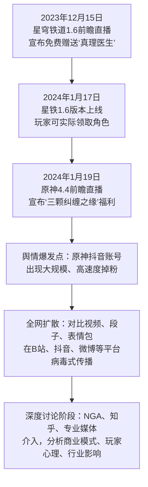

## 一、事件概述

本次舆情事件的核心是米哈游旗下两款旗舰游戏《崩坏：星穹铁道》与《原神》在福利策略上的显著差异，引发了大规模的玩家情绪对比与宣泄。事件于2023年12月因《星穹铁道》宣布免费赠送限定五星角色“真理医生”而埋下导火索，并于2024年1月19日《原神》4.4版本前瞻直播宣布春节福利（包含“三颗纠缠之缘”）后集中爆发，导致《原神》官方抖音账号在两天内掉粉约200万，舆论迅速蔓延至全网。事件样本覆盖B站、抖音、微博、NGA等主流社区，核心参与者以《原神》玩家为主，整体情绪极性以强烈的失望与愤怒为主导，夹杂着《星穹铁道》玩家的狂欢与嘲讽，对立情绪显著。

## 二、事件时间线

事件的发展并非孤立，而是基于两款游戏不同运营策略长期积累的对比性矛盾，在关键节点被引爆。下图梳理了其关键进程：

**文字说明**：
*   **首次出现与引爆**：“真理医生”赠送消息首先在《星穹铁道》前瞻直播中官宣，其“免费赠送限定五星”的激进性质在游戏社群中引发第一次震动。但真正的舆情引爆点是《原神》的福利宣布，后者直接成为了前者的“对照组”，激活了玩家积压的情绪。
*   **转折与扩散**：关键的转折点在于《原神》福利宣布后，大量玩家自发制作并传播对比内容（如抖音热评“我们将为旅行者们奉上三颗纠缠之缘”）。B站的反应视频、弹幕文化（如“肃然起敬”、“义父”梗）加速了情绪的娱乐化传播与共识凝聚，使事件从单一游戏圈层扩展为全网公共议题。
*   **深层发酵**：当情绪宣泄达到峰值后，理性和深度的讨论开始涌现，聚焦于米哈游的商业模式差异、玩家信任危机及二游行业竞争态势，事件性质从福利对比上升至运营哲学冲突。

## 三、核心矛盾拆解

**矛盾双方**：
1.  **《原神》玩家（及部分跨游戏玩家）**：核心诉求是获得公平的对待、符合预期的运营诚意以及对长期支持的尊重。
    *   诉求引用：“不是要你送，是要你态度。”——B站弹幕。
    *   诉求引用：“米哈游区别对待，原神玩家心寒。”——NGA评论。
2.  **米哈游（及其运营策略所代表的立场）**：核心诉求是维持其既定的商业化模式、不同产品的差异化运营定位，以及在不同生命周期阶段采取不同的用户获取策略。
    *   策略引用：“原神有‘海灯节’、‘周年庆’这种大型版本福利，而星铁送角色更偏向于新版本拉新和热度维持。”——NGA讨论。
    *   背景引用：“原目前说是旗舰定位，运营走的应该就是高价高质路线……福利上比较抠，营收（压力）”——知乎分析。

**冲突性质**：双方诉求存在根本性的、在当前框架下难以调和的冲突。玩家的诉求基于情感和相对剥夺感，而厂商的决策基于商业逻辑和产品战略。这背后深层的行业背景是：二游行业进入存量竞争阶段，玩家对福利的预期标准被不断抬高，而以《原神》为代表的“高价高质、低福利”模式与以《星穹铁道》为代表的“高话题性、福利拉新”模式在同一公司体系内并存，形成了尖锐的内部对比和外部攻击点。

## 四、信息环境与情绪分布

**数据概览（基于证据池可观察样本）**：

| 平台 | 主要样本形式 | 主导情绪/行为 | 特征描述 |
| :--- | :--- | :--- | :--- |
| **B站** | 弹幕、评论、视频 | 惊喜、狂欢、嘲讽 | 聚焦主播反应视频，“义父”梗成为文化符号，欢乐氛围中隐含对《原神》的调侃。 |
| **抖音** | 评论、短视频 | 愤怒、失望、直接对比 | 情绪表达直接激烈，高频使用“隔壁”、“三颗纠缠之缘”等关键词进行对比，易引发共鸣与扩散。 |
| **NGA/贴吧** | 帖子、长文分析 | 失望、理性批评、策略分析 | 深度讨论福利策略差异与玩家不满根源，理性分析与情绪宣泄并存，是核心矛盾剖析场。 |
| **微博** | 话题、热搜讨论 | 对立、舆论压力 | 事件登上热搜，成为公共话题，官方账号面临直接的舆论压力，讨论兼具情绪化与观点输出。 |
| **知乎** | 问答、文章 | 理性分析、行业视角 | 偏向商业模式、行业影响等理性分析，声音相对理性，但传播声量小于情绪化平台。 |

**环境分析**：
*   **情绪煽动者**：存在大量通过直接对比（如福利内容、角色价值）激发相对剥夺感的玩家，他们的评论（如抖音热评）本身成为情绪催化剂。
*   **被淹没的理性声音**：关于《原神》商业模式可持续性、角色价值保值等理性分析声音，在情绪狂欢初期被大量淹没，但随后在垂直社区和深度分析文章中逐渐浮现。
*   **关键意见领袖（KOL）角色**：游戏主播、UP主通过“反应视频”等形式，以娱乐化方式参与传播，客观上放大了事件的知名度和戏剧性。行业分析师、深度游戏媒体则从商业和行业角度提供了理性框架，将讨论引向深入。

## 五、社会背景与深层病灶

此次事件并非偶然，它精准触碰了当下玩家群体的两大集体焦虑：
1.  **相对剥夺感与公平焦虑**：在信息高度透明的网络环境下，同一公司不同产品间的福利差异极易被感知和放大。玩家不再仅与自身过往体验纵向对比，更会与同生态位的其他产品进行横向对比，任何“厚此薄彼”的迹象都会引发强烈的不公平感。
2.  **信任焦虑与预期管理失败**：玩家对游戏厂商的信任建立在长期、一致的运营表现之上。当一款产品（《原神》）长期被贴上“福利保守”标签，而另一款新产品（《星穹铁道》）却以高福利姿态出现时，会加剧玩家对前者运营诚意的质疑，认为自己的长期支持未被珍视，导致信任损耗。

事件暴露了特定领域长期存在的问题：**随着游戏作为长期服务产品，厂商的福利策略已不再是简单的成本支出，而是复杂的产品定位、用户生命周期管理和商业模型维护工具**。然而，厂商的策略逻辑（如《原神》的“保值”模型）往往未能与玩家进行有效、透明的沟通，导致策略在执行层面引发理解断层和情绪对抗。

## 六、结论与演化推演

**核心问题与分歧**：事件的根本分歧在于**厂商的商业化、差异化运营策略**与**玩家追求的情感认同、公平对待及一致性预期**之间的冲突。福利只是一个具象化的导火索。

**客观影响与后续讨论**：
*   根据证据池，事件对《原神》的品牌形象和玩家短期信任度造成了可观察的负面影响（如抖音大规模掉粉）。
*   行业层面，该事件被广泛讨论，被认为提高了二次元游戏福利的“基准线”，对其他厂商的运营策略构成了无形的压力。
*   关于后续影响的讨论，目前集中在米哈游如何修复《原神》玩家的信任（如对未来福利的预期）、以及其内部如何平衡两款产品的定位以避免持续内耗。玩家社群内部的“对比”话语体系已建立，这将成为未来监督和评判运营行为的一个长期框架。