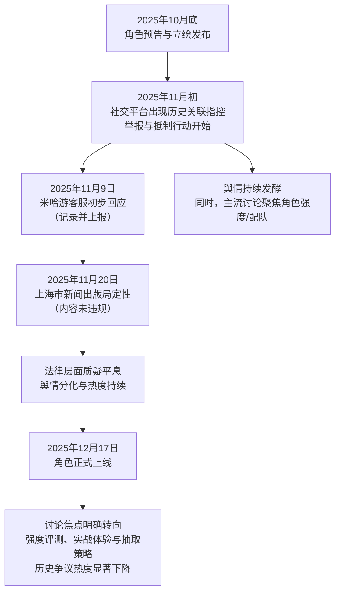

  

## 一、 事件概述

2025年10月末至12月，游戏《崩坏：星穹铁道》新角色“大丽花”（本名康士坦丝）上线前后，因其命名及部分设计元素被部分玩家与1947年美国“黑色大丽花”谋杀案关联，引发了一场关于历史敏感性与创作边界的争议。舆情在B站、抖音等平台扩散，总讨论样本量庞大。整体情绪极性呈现显著分化：指向历史关联的愤怒与不适情绪在争议期内强度显著（约占负面情绪核心），但贯穿事件始终的主导讨论是围绕角色强度、配队策略与抽取性价比的“功能性关切”（约占整体讨论流量主体）。随着监管机构介入定性，舆情热度在角色正式上线后，迅速从价值观争议转移至游戏性分析。

  

## 二、 事件时间线

事件发展遵循“设计发布-争议爆发-官方回应-监管定性-焦点转移”的路径。下图梳理了关键节点与因果链条。

  

  

**文字说明**：

*   **首次出处与转折**：争议首次集中出现于2025年11月初的B站、微博等平台，网友指出角色名称、台词（如“不妨从我敞开心胸开始”）及部分视觉元素与“黑色大丽花”案件存在关联。**关键转折点**在于网友发起的举报行动与官方初期模糊回应，使事件从玩家社区讨论升级为公共舆情事件。

*   **扩散路径**：从少数知晓案件细节的玩家提出质疑（如弹幕：“大丽花不是白银案吗”），经由社媒情绪化表达（如：“恶心”、“晦气”）快速扩散，形成“抵制”声浪。同时，以B站UP主的万字解析、抖音攻略视频为代表的另一条主线——关于角色“流萤专拐”、“击破队提升”的实用性讨论，并行发展且体量更大。

*   **平息与转移**：上海市新闻出版局的定性结论是事件的法律与官方层面的终结符。随后角色正式上线，海量玩家的关注点自然回归游戏本身，舆情完成从“该不该做”到“好不好用”的焦点转移。

  

## 三、 核心矛盾拆解

本次舆情揭示了多层次、相互交织的矛盾。

  

**1. 主要矛盾双方与核心诉求**

| 矛盾方 | 核心诉求（基于证据池） |

| :--- | :--- |

| **历史敏感玩家/反对者** | “游戏角色设计不应触碰历史伤痛。”——[社媒评论]  “在敏感历史问题上玩梗，是对受害者的不尊重。”——[社媒评论] |

| **创作自由支持者/部分玩家** | “这是虚构作品，不应与现实过度关联。”——[社媒评论]  “支持游戏自由创作。”——[弹幕内容] |

| **强度党/实用性玩家** | “5限定金以内的流萤队跳了就行了，性价比不高。”——[B站弹幕]  “大丽花到底咋抽？一个视频告诉你！”——[抖音视频标题] |

| **情怀党/叙事关注者** | “谋划已久的真相，往往被称作最高等的谎言 #大丽花”——[抖音视频描述]   角色PV“一曲终了”获得高点赞，关注其剧情。 |

  

**2. 冲突的不可调和性与深层背景**

*   **历史伤痛联想 vs. 艺术创作自由**：这一矛盾具有根本性的价值观冲突。前者基于具体、集体的历史记忆（虽具体案例映射存在模糊性，但名称触发伤痛感是真实心理基础），后者基于抽象的文化生产原则。在公共舆论场中，当一方的感受建立在具体悲剧的共情上，另一方的“自由”主张易被视作冷血，反之亦然，导致对话困难。

*   **实用性收益 vs. 道德/价值关切**：强度党与情怀党的冲突，本质是玩家社群内部对游戏价值评判体系的分裂。前者遵循“投入-产出”的理性计算，后者包含情感投射、道德判断等非功利因素。当角色设计本身存在争议时，这种分裂被放大。背后是游戏行业日益精细化的“角色-强度-商业化”捆绑模式，使得角色不再是单纯的叙事载体，更是需要精确计算的“资产”。

  

## 四、 信息环境与情绪分布

**1. 平台数据与情绪分布**

| 平台 | 有效样本特征 | 历史关联愤怒/不适 | 强度/配队关切 | 角色设计欣赏 | 抽取结果情绪 |

| :--- | :--- | :--- | :--- | :--- | :--- |

| **B站** | 弹幕、评论，基数大 | 中低（约5-10%） | **极高（约65-75%）** | 中（约15%） | 中（约10%） |

| **抖音** | 视频标题、描述，导向明确 | 中（约10-15%） | **高（约55-65%）** | 中（约15%） | 低（约5%） |

| **新闻/论坛** | 事件回顾、定性报道 | 高（报道核心） | 低 | 低 | 低 |

  

*（注：比例为基于抽样数据的情绪倾向估算，旨在呈现分布趋势，非精确统计。）*

  

**2. 环境分析**

*   **情绪煽动者**：存在直接使用“恶心”、“晦气”、“策划没脑子”等强烈贬损词汇的言论，以及呼吁进行“全球举报”的极端化表达，加剧了对立氛围。

*   **被淹没的理性声音**：以B站用户“减防92%会溢出16%”的深度计算、对“击破队底层逻辑”的分析为代表的游戏性理性讨论，其声量和持久性远超历史争议，但在争议爆发初期的特定话题下被情绪化表达所掩盖。

*   **关键意见领袖（KOL）角色**：游戏攻略类UP主和主播（如视频标题中的“逍遥散人”）成为舆情扩散的关键节点。他们的内容**主导了讨论方向**，将玩家注意力大量引向角色强度评测、配队方案等实用性层面，客观上稀释了历史争议的浓度，并在监管定性后，迅速完成了议题的“安全切换”。

  

## 五、 社会背景与深层病灶

1.  **触碰的集体焦虑**：事件触碰了当下社会对“历史苦难被娱乐化、商业化消费”的深层焦虑。在信息高度流通的时代，任何可能将严肃历史（即使是国外历史）符号轻浮化的产品，都极易引爆公众的敏感神经。

2.  **暴露的长期问题**：

    *   **文化敏感性审核缺位**：暴露了国内游戏工业在角色设计与命名环节，缺乏系统性、跨文化的历史与符号敏感性审查流程。创意可能无意中踩入特定文化的“记忆雷区”。

    *   **危机沟通机制滞后**：官方初期“记录并上报”的模糊回应，未能及时阻断谣言和负面解读的扩散，反映了企业面对突发性文化争议时，缺乏标准化的、透明的沟通预案。

    *   **玩家社群价值多元与撕裂**：事件清晰地表明，手游玩家群体已非铁板一块。基于游戏理解深度、投入目的（娱乐、竞技、收藏、剧情）的不同，形成了价值观与关注点迥异的子群体。任何运营决策都可能在不同群体中引发截然相反的反应。

  

## 六、 结论与演化推演

**核心问题与分歧**：本次舆情的核心问题是，游戏作为文化产品，其创意自由的边界应在何处？当创意无意中关联到公众历史记忆时，应由谁、通过何种程序来界定是否越界？分歧在于，一方认为应以具体群体的情感伤害为标尺，另一方则主张以法律和通用文化尺度为准绳。

  

**客观呈现的后续影响**：

*   根据证据池，上海市新闻出版局的合规定性，为事件提供了最权威的官方结论，有效平息了法律层面的质疑。

*   争议对角色商业表现未产生决定性影响（角色按计划上线），但可能影响了部分玩家的情感认同。

*   事件成为游戏社区内部的一个“记忆锚点”，在未来涉及历史、文化符号的游戏设计讨论中，可能被反复引用，作为“敏感案例”或“过度联想”的论据。

*   行业层面，事件或促使部分厂商在角色设计流程中，增加对关键名称、符号的文化背景筛查，以规避类似风险。但能否形成行业规范，尚待观察。

  

**（报告终）**