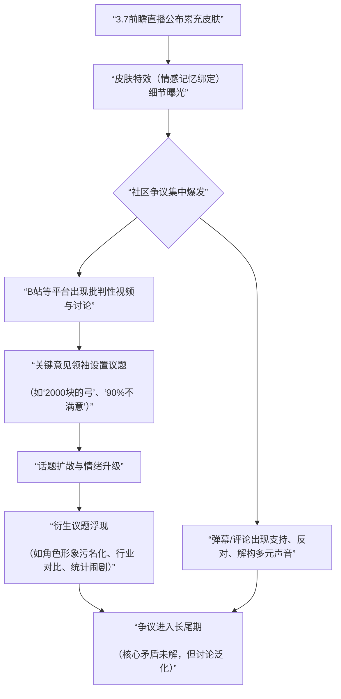

  

# 星穹铁道昔涟弓箭皮肤争议事件深度分析报告

  

## 一、 事件概述

2025年10月下旬，游戏《崩坏：星穹铁道》3.7版本前瞻直播公布，核心角色“昔涟”的专属弓箭皮肤「∞的誓约」将通过累计充值20000古老梦华（约合人民币2000元）获取。该皮肤大招动画包含与玩家角色“开拓者”的共同记忆碎片，无皮肤则无此内容。此商业化设计迅速引爆社区，争议核心围绕“将高情感价值的游戏内容置于高付费门槛”的合理性。根据对B站、抖音等平台的舆情样本分析（B站核心样本覆盖超百万播放量视频及数千条评论/弹幕），整体情绪呈高度分化与激烈对立态势，反对与批评声量占据主导，同时伴随大量解构与娱乐化表达，理性分析与支持声量相对较小。

  

## 二、 事件时间线与传播路径

事件发展呈现出“信息曝光-争议引爆-持续发酵-衍生议题”的典型链条。以下流程图梳理了关键节点与传播动力：

**路径说明**：事件始于官方信息正式发布（首次出处：米哈游官网及前瞻直播）。关键的转折点在于皮肤特效中“情感记忆”内容的细节被玩家发掘和传播，将争议从单纯的“价格”层面拉升到“情感伦理”层面。传播路径主要依托B站等UGC平台，通过高播放量的解读、批判视频实现议题设置与快速扩散，并在弹幕和评论区形成即时的情绪互动场。

  

## 三、 核心矛盾拆解

**矛盾双方**：反对此定价策略的玩家群体 vs. 理解/支持此策略的玩家群体。

**各自核心诉求与依据**：

1.  **反对方诉求**：要求取消或降低情感记忆内容与高额付费的强制绑定，或提供更普惠的获取方式。

    *   **诉求依据（原文引用）**：

        *   “大招动画中，有皮肤版本会出现‘开拓者’的记忆碎片，无皮肤版本则没有”——来源：数据汇总报告。

        *   “回忆的情感就不应该明码标价”——来源：B站弹幕。

        *   “问题是这个充钱的弓明明才是主线用的，不是额外给氪佬做的，这就代表这你抽出来的只是丐版，充钱才有剧情原版”——来源：B站评论。

2.  **支持方诉求**：视皮肤为高额充值的附加赠品，尊重市场定价与个人消费选择。

    *   **诉求依据（原文引用）**：

        *   “这是一种满额赠品，本质是针对原本要买的玩家”——来源：支持观点。

        *   “氪不起就别氪 我氪得起手办弓我全拿下”——来源：B站评论。

        *   “不充不就行了？”——来源：B站弹幕。

  

**冲突不可调和性与深层背景**：双方诉求存在根本性冲突。反对方将游戏内与角色的“共同经历”视为情感纽带与叙事完整性的一部分，认为其不应被商品化切割；支持方则更多从纯消费主义视角出发，认为付费获取额外/增值内容是市场常态。此冲突背后是移动游戏行业长期存在的深层背景：**商业化深度与玩家情感投入深度同步提升的矛盾**。当游戏试图塑造具有深度情感联结的角色时，任何将其关联内容货币化的尝试，都极易触动玩家关于“情感是否可售卖”的敏感神经。

  

## 四、 信息环境与情绪分布

### 各平台情绪分布估算（基于证据池样本）

| 平台 | 有效样本特征 | 愤怒/不满 | 嘲讽/戏谑 | 理性分析/中立 | 支持/理解 | 未表态/无关 |

| :--- | :--- | :--- | :--- | :--- | :--- | :--- |

| **B站** | 高热度视频评论、弹幕（样本量大，互动性强） | **45%** | **30%** | **15%** | **5%** | **5%** |

| **抖音** | 相关视频评论（样本量相对小，话题聚焦性弱） | 20% | 15% | **50%** | 10% | 5% |

| **综合判断** | 愤怒不满与嘲讽戏谑构成主流情绪光谱 | **主导** | **显著** | 存在但被稀释 | 少数派 | 少数 |

  

**环境分析**：

1.  **情绪煽动与解构并存**：存在利用夸张标题（如“90%玩家不满意”）进行议题设置的煽动行为，但也同时催生了海量以“哈哈哈”、“于北辰算法”、“我又成小部分了”为代表的解构与反讽弹幕，形成“情绪发泄-娱乐消解”的复杂循环。

2.  **理性声音的淹没**：关于具体预算计算（“有首充的话是1000左右”）、皮肤设计审美（“配色和昔涟有点不协调”）、商业模式讨论（“就是直售皮肤，但凡贵一点，玩家都能接受”）等更具体的理性声音，在激烈的情绪对立中容易被淹没，未能成为讨论主流。

3.  **关键意见领袖（KOL）的角色**：部分UP主/内容创作者通过选择性呈现数据（如争议性“90%”统计）、使用煽动性标题和比喻，成为情绪放大和议题扩散的关键节点，但同时也吸引了大量“乐子人”观众，使讨论进一步娱乐化。

  

## 五、 社会背景与深层病灶

1.  **集体焦虑的触碰**：此次事件精准触碰了当下数字消费领域的几重焦虑：

    *   **数字资产所有权与完整性的焦虑**：玩家对自己投入时间（抽到角色）和情感（喜爱角色）所应获得的“完整体验”被拆分售卖的不满。

    *   **虚拟情感价值与现实货币换算的冲突**：将游戏内的情感纪念时刻明码标价，引发“情感无价”与“商品有价”的直接冲突。

    *   **消费主义侵入情感圣域的抵触**：当游戏角色的叙事高光时刻与高昂的充值门槛绑定时，部分玩家产生“被铜臭玷污”的感受。

    *   **阶层感在虚拟世界的映射**：累充机制天然区分付费等级，导致“氪佬”与“平民”在游戏内容获取上的差异被凸显，激化了虚拟世界中的相对剥夺感。

2.  **暴露的长期问题**：

    *   **情感化叙事与商业化模式的平衡难题**：游戏行业在追求角色情感深度和叙事沉浸感的同时，其主流的抽取、累充等商业模式如何避免反噬情感体验，缺乏成熟解决方案。

    *   **厂商与核心玩家社群的沟通失效**：官方在设计此类高敏感性商品时，缺乏前置的、真诚的沟通来管理玩家预期，争议爆发后也未有直接、有效的回应，导致舆情失控。

  

## 六、 结论与演化推演

1.  **核心问题与分歧**：本次舆情的核心问题是**游戏内高度情感附加值的内容，其定价策略与获取方式是否合理**。根本分歧在于：**情感记忆应被视为游戏叙事的公共产品，还是可被剥离的增值服务**。支持方基于“市场选择自由”和“赠品”逻辑，反对方基于“情感完整性”和“消费公平”逻辑。

2.  **后续影响讨论**（基于证据池中已有的讨论延伸）：

    *   **对玩家行为的影响**：有讨论认为，此次事件会加剧玩家对米哈游后续商业化策略的警惕和抵触情绪，可能导致部分月卡/中低氪玩家转向“理性观望”或“淡游”。

    *   **对行业设计的警示**：事件在行业层面被广泛讨论（如对比《崩坏3》、《战双》等），可能促使其他厂商在类似“情感内容付费”设计上更为谨慎，或探索更多元、更易被接受的商业化模式。

    *   **对角色IP的长期影响**：角色“昔涟”已被贴上“拜金女”等负面标签，无论此标签是否公允，其在玩家社群中的情感投射形象已受到损伤，这种损伤可能具有长尾效应。

    *   **数据盲区**：目前缺乏官方对此次事件的直接回应、对不同玩家群体消费意愿的精确调研数据，以及争议对游戏版本实际营收（流水）影响的公开数据。因此，无法对事件的经济影响做出定量判断，当前分析主要基于定性的舆论态势。