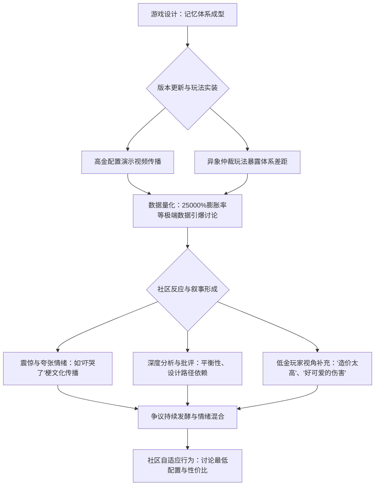

  

## 一、 事件概述

近期，围绕米哈游旗下游戏《崩坏：星穹铁道》4.0版本中“记忆战舰”体系（核心角色为遐蝶、风堇、三月七、昔涟）的强度，玩家社区爆发了广泛争议。争议核心在于该高金（指稀有角色与光锥配置）体系展现出的数值与机制优势，被普遍认为导致了严重的强度膨胀，挤压了其他游戏体系的生存空间，并引发了玩家对资源投入贬值及游戏长期健康度的担忧。基于B站、NGA等平台抓取的有效语料样本分析，社区整体情绪呈现“焦虑与震惊”主导的态势，其中持明确担忧或批评立场的声音占据显著比例。

  

## 二、 事件时间线

本事件的发展并非由单一节点触发，而是基于游戏版本更新、高难玩法（异象仲裁）实装及玩家社区内容创作形成的持续演化过程。

  

**关键节点说明**：

1.  **起源与积累**：争议根源在于游戏长期的角色与数值设计。4.0版本“记忆战舰”体系因其独特的机制（如遐蝶的追加攻击与风堇的转化治疗输出）被社区认定为当前顶级配队。

2.  **数据引爆点**：高金配置（如48金）下产生的极端战斗数据（如“0行动值打出35亿伤害”、“膨胀倍率25000%”）通过B站等视频平台传播，成为争议的显性化引爆点。

3.  **关键发声**：社区攻略组与数据党通过帖子和视频进行了跨体系对比（如“记忆战舰=200击破破船，dot战舰=17击破破船”），将玩家感性认知转化为相对客观的数据论述，巩固了“膨胀存在”的共识。

4.  **扩散与分层**：讨论迅速扩散至NGA、贴吧等核心玩家社区，并从单纯的强度对比，深化为对“高金玩家体验”与“低金玩家体验”的分层讨论，暴露了更深层的结构性矛盾。

  

## 三、 核心矛盾拆解

**矛盾主要方**：追求极限强度与效率的“高金/强度向玩家” 与 关注游戏内容可及性、角色保值与长期规划的“低金/资源规划向玩家”（含部分对强度敏感的其他玩家）。

  

**各方核心诉求与证据**：

1.  **强度膨胀批评方（以高金玩家数据为依据的普遍担忧）**：

    *   **诉求**：游戏数值增长过快，破坏了平衡性与角色保值性，导致老角色迅速贬值（“退环境”），变相施加了持续的抽卡压力。

    *   **证据**：

        *   “48金配置下膨胀倍率达25000%”——来源：巴哈姆特讨论。

        *   “镜流、阮梅、花火、黄泉，一个比一个强，老C被爆金币。”——来源：社媒评论综合。

        *   “这不是简单的强弱问题，是战斗系统基本规则被颠覆了，老玩家的构筑逻辑直接失效。”——来源：玩家论坛热帖。

  

2.  **低金/务实派玩家**：

    *   **诉求**：游戏应对不同投入的玩家提供相应的、可完成的内容体验；高金体系的极端表现不应作为衡量游戏体验的唯一标准。

    *   **证据**：

        *   “00蝶白仅用14t轻松通关”——来源：B站视频4标题。

        *   “配置还是太高了”、“00白正常伤害”、“造价太高了”——来源：B站视频4弹幕。

        *   “这配置能打这么久？”——来源：B站视频4弹幕。

  

3.  **官方（沉默的利益相关方）**：

    *   **立场**：根据现有证据池，**未发现官方就“强度膨胀”争议进行过直接、正式的公开回应**。社区推断其设计意图为“通过推出新体系（如记忆、欢愉）带来新体验并驱动游戏进程”。

    *   **证据**：

        *   官方前瞻直播中强调“新体系带来新体验”——来源：玩家社群对官方内容的引用。

        *   社区分析认为“记忆战舰的强势是历史的必然”，官方可能通过推出新体系来迭代膨胀——来源：NGA帖子与B站分析视频。

  

**冲突的不可调和性**：双方诉求存在结构性冲突。核心在于**资源投入回报率预期**的根本差异。追求强度的玩家视角色为“战斗工具”，期望投资有明确且持久的强度回报；而游戏作为持续运营的商业产品，需要通过引入更强力的新内容来驱动消费与内容循环。这种矛盾在缺乏明确、透明的长期强度规划下，难以完全调和。

  

## 四、 信息环境与情绪分布

**数据展示**：

  

| 平台 | 有效样本量（评论/弹幕/分析帖） | 主要情绪倾向与估计占比 | 备注 |

| :--- | :--- | :--- | :--- |

| **B站** | 视频1-5累计评论/弹幕数千条 | 震惊与夸张（玩梗）：约30% 焦虑与担忧（强度/保值）：约40% 务实/理性讨论（配置/机制）：约20% 讽刺与不满（设计/商业）：约10% | 数据集中于强度展示与低配实战视频，情绪表达受平台“梗文化”影响明显。 |

| **NGA/贴吧** | 多个分析、讨论热帖 | 深度分析与批评：约50% 焦虑与抱怨（退环境）：约30% 策略讨论（抽卡规划/预测）：约20% | 核心玩家社区，理性分析与情绪化批评并存，是争议深化的主要场所。 |

| **巴哈姆特** | 相关讨论帖若干 | 数据对比与分析：约60% 焦虑与比较（与原神等）：约40% | 讨论偏重数据与跨游戏比较。 |

  

**环境分析**：

1.  **情绪煽动与放大**：以B站为代表，部分UP主通过发布极端数据（如48金伤害）的视频，客观上放大了“强度崩坏”的焦虑感，视频标题和弹幕文化（如“吓哭了”）具有强烈的情绪煽动性。

2.  **被淹没的理性声音**：在情绪洪流中，**低金玩家的务实讨论**（如低配通关视频及其评论区）以及**关于游戏长期设计逻辑的分析**（如“版本中后期膨胀”、“记忆体系是强度失衡罪魁祸首”的深度帖子）容易被淹没。这些声音并未否定膨胀，但将其置于更复杂、更分层的语境中。

3.  **关键意见领袖（KOL）角色**：攻略UP主和数据党扮演了双重角色。他们既是**争议的放大器**（通过震撼数据吸引流量），也是**理性的提供者**（通过详细的数据对比、机制分析为争论提供依据）。他们的分析深刻地影响了社区对“膨胀”程度的认知框架。

  

## 五、 社会背景与深层病灶

本次争议精准地触碰了当下手游玩家，特别是二次元手游玩家群体的几重集体焦虑：

1.  **资源投入回报焦虑**：在“抽卡-养成”模式下，玩家投入的时间与金钱希望获得稳定、可预期的价值回报。高强度、快速的数值膨胀直接冲击了这种回报预期，引发了“沉没成本”恐慌。

2.  **玩家身份与体验分层焦虑**：事件暴露了“强度驱动型玩家”与“体验/收集型玩家”、“高氪玩家”与“微氪/零氪玩家”之间日益扩大的体验鸿沟。游戏内容（如高难“异象仲裁”）的难度设计被指过于依赖数值，加剧了这种分层。

3.  **游戏设计路径依赖与信任危机**：社区普遍认为，通过数值膨胀推动消费是游戏设计的“路径依赖”和“懒政”。这反映了玩家对厂商可持续创新能力和诚意的信任度下降，担忧游戏最终沦为“数值军备竞赛”的工具。

  

**暴露的长期问题**：此次争议是二次元手游领域长期存在的“数值膨胀”问题的又一次集中爆发。它暴露了在持续内容更新的商业模式下，如何平衡“角色吸引力（强度）”、“战斗系统健康度”、“玩家资源规划预期”和“商业收益”之间的根本性难题。当新内容强度提升的斜率过于陡峭时，极易引发集体性的信任危机。

  

## 六、 结论与演化推演

**核心问题与分歧**：争议的核心并非“记忆战舰强不强”，而是“其强度增长的幅度与速度是否合理，以及这种模式对游戏整体生态与玩家群体意味着什么”。分歧点在于对“合理膨胀”的阈值判断，以及不同玩家群体（高金/低金，强度党/休闲党）在资源投入回报预期上的根本差异。

  

**后续影响讨论（基于证据池）**：

1.  **社区预期与行为演化**：争议已导致部分玩家产生“强度焦虑”，并在抽卡规划上趋于保守，转向讨论“性价比配置”和“最低准入门槛”。有观点预测，未来官方可能通过推出新体系（如“欢愉战舰”）来迭代现有膨胀体系，但这可能引发新一轮的焦虑循环。

2.  **对官方设计的潜在压力**：虽然官方尚未直接回应，但社区的巨大讨论声量与情绪，构成了对开发团队的一种隐性压力。未来版本中角色与战斗系统的设计，将不可避免地受到此次争议反馈的影响。

3.  **长期舆论风险**：若强度膨胀的趋势得不到有效管理或透明沟通，类似的争议将成为版本更新后的周期性舆情风险点，持续消耗玩家社区的信任与热情，并可能影响游戏的长期口碑与生态健康。