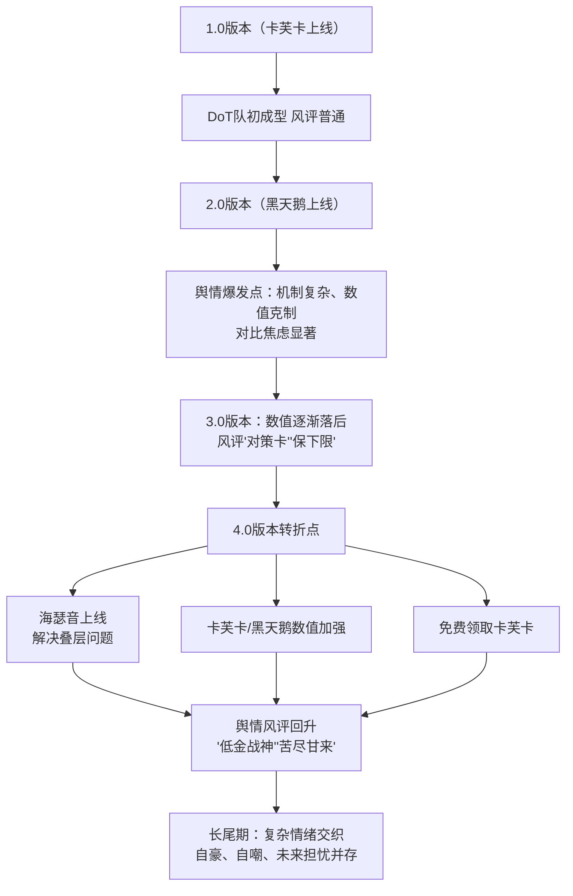

# 一、事件概述

自《崩坏：星穹铁道》2.0版本（2024年2月）上线五星角色“黑天鹅”以来，围绕以她及卡芙卡为核心的持续伤害（DoT，俗称“dot”）体系角色强度的讨论，在核心玩家社区持续发酵。舆情总样本横跨B站、抖音、NGA、贴吧、知乎等主要平台，讨论周期长达数个版本。

整体情绪极性经历了从2.0-3.0版本以“深度失望”与“机制质疑”为主（负面情绪占主导），到4.0版本因角色加强与“海瑟音”上线后，转向“自豪、自嘲、担忧并存”的复杂混合状态。

舆情核心并非单纯强度不足，而是**“高期待—复杂机制—阶段性强度落差”**所引发的体验危机，以及后续“价值重估”的集体情绪演变。

---

# 二、事件时间线

## 关键节点说明

### 1. 高期待下的体验落差（2.0版本）

黑天鹅作为DoT体系首个真正意义上的五星核心补强角色上线后，社区普遍预期其能够将DoT体系推向主流输出队伍行列。

然而角色正式实装后，舆论迅速出现分化：

- 机制设计复杂，学习成本较高；
- 实战收益与宣传预期存在落差；
- 对单环境表现受限；
- 与同期主流直伤体系相比缺乏爆发优势。

社区逐渐形成：

> “机制超模，数值克制”

的主流评价框架。

此阶段玩家讨论重点集中于：

- 黑天鹅是否达到限定五星标准；
- DoT体系是否值得长期投入；
- 复杂机制是否换来了对应收益。

负面情绪主要表现为失望、质疑与观望。

---

### 2. 体系边缘化与价值怀疑（2.1-3.X版本）

随着黄泉、流萤等新体系陆续登场，DoT体系在高难环境中的竞争力逐渐下降。

社区叙事开始发生变化：

从最初的

> “黑天鹅强度不符合预期”

逐渐演变为

> “整个DoT体系被版本放弃”。

这一时期大量负面标签开始固化：

- 对策卡
- 保下限体系
- 版本陷阱
- 坐牢队

玩家关注点也从角色本身转向体系未来：

- 后续是否还有专属辅助；
- 深渊环境是否会继续适配；
- 卡芙卡与黑天鹅是否已经进入淘汰周期。

此阶段形成了DoT体系历史上最严重的信任危机。

---

### 3. 体系修复与价值重估（4.0版本）

4.0版本成为DoT体系舆情的重要转折点。

官方连续释放多个积极信号：

1. 海瑟音上线，解决长期存在的叠层与启动问题；
2. 卡芙卡、黑天鹅获得数值加强；
3. 免费赠送卡芙卡，降低体系组建门槛。

三个因素共同作用下，社区评价开始快速修正。

此前长期存在的：

> “投入打水漂”

叙事逐渐转变为：

> “坚持终于得到回报”。

大量玩家开始重新评估DoT体系价值。

相关高频关键词变为：

- 低金战神
- 苦尽甘来
- 登神
- 投资回报

舆情整体从负面主导转向正面修复。

---

### 4. 风评回暖后的隐性焦虑（当前）

虽然DoT体系已重新回到主流讨论范围，但社区情绪并未完全转为乐观。

当前玩家情绪呈现明显的混合状态：

- 对体系加强感到满意；
- 对长期坚持获得回报感到自豪；
- 对过去遭遇保持自嘲；
- 对未来环境变化保持警惕。

典型讨论包括：

> “这次终于轮到DoT了。”

> “断头饭还能吃多久？”

> “以后会不会又被版本抛弃？”

说明当前风评改善建立在版本环境与角色加强基础之上，其稳定性仍有待后续版本验证。

从舆情角度看，DoT体系已完成从「价值质疑」到「价值重估」的转变，但尚未完全摆脱未来再次退环境所带来的不确定性焦虑。
