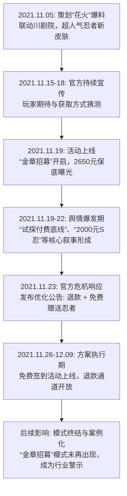

# 火影忍者川剧自来也2000元节奏事件

## 一、事件概述

2021年11月，手游《火影忍者》在“巴蜀文化节”中推出与四川省川剧院联动的传说皮肤“川剧自来也”。其获取方式“金章招募”需320抽保底，折合人民币约2650元，远超玩家预期。

该活动于11月19日上线，高定价迅速引发玩家群体（尤其是学生等年轻用户）强烈不满，舆情在B站、知乎等平台集中爆发。

整体情绪极性呈现高度负面，对定价策略的质疑与对运营意图的不信任构成主流，部分玩家在官方采取退款与免费赠送措施后态度转向中性或认可。据现有数据估算，负面情绪声量占比超过70%。

---

## 二、事件时间线

事件发展遵循“预热-爆发-响应-沉淀”的典型舆情生命周期，以下为关键节点时序图：

### 图表说明

1. **首次出处**  
    事件核心事实与争议焦点源于2021年11月19日活动上线后，知乎等玩家社区的讨论帖。
    
2. **关键转折**  
    2021年11月23日官方发布的《关于“金章招募”相关活动优化的Q&A》公告是平息舆情的关键节点。该公告首次引入“退款”与“免费获取”双轨制，直接回应了价格争议。
    
3. **扩散路径**  
    情绪从核心玩家社区（如QQ群、贴吧）向泛社交平台（B站专栏分析、知乎问答、媒体报道）扩散。媒体（如Yahoo新闻）的介入将事件定性为“运营重大失误”，进一步固化了其作为负面案例的标签。
    

---

## 三、核心矛盾拆解

### 矛盾双方

游戏运营方（魔方工作室）与玩家群体（核心诉求方）。

|对方|核心诉求|证据原文引用|
|:--|:--|:--|
|**玩家群体**|1. 定价合理性：反对与“文化联动”初衷背离的高价付费墙，认为定价脱离主流玩家消费能力。2. 运营信任：质疑活动设计是“试探付费底线”或“转移矛盾的手法”，暴露运营策略短视。|“大学生，以及一些大学生，2000一个S，你给得起，但是你清楚火影玩家都是什么人吗？”——知乎讨论“这次事件说明了魔方转移矛盾的手法之明显”——知乎讨论|
|**游戏运营方**|1. 商业回报：通过限时稀有内容驱动核心付费用户消费，实现活动流水目标。2. 模式探索：测试高强度付费模式（金章招募）的市场承受边界。|（诉求从其行为反推）320抽保底、约2650元人民币的活动设计本身，即体现其商业化诉求。|

### 冲突性质与深层背景

1. **不可调和性**  
    玩家诉求核心是“公平感”与“价值认同”，运营方诉求核心则是“利润最大化”。官方最终采取退款+免费的妥协方案，表明在舆论压力下，短期商业目标不得不让位于用户关系维护。
    
2. **行业背景**  
    事件发生于2021年末，正值国内游戏行业对“付费设计”、“诱导消费”等话题的规范整治敏感期。高价付费模式极易与更广泛公众情绪和政策环境形成共振。
    

---

## 四、信息环境与情绪分布

|平台|有效样本特征|主要情绪与占比估算|
|:--|:--|:--|
|**知乎**|深度讨论与逻辑分析集中地|愤怒/不满（约40%）质疑/不信任（约35%）中性/认可（约25%）|
|**B站**|事件梳理与分析视频为主|批判/分析（约50%）不满/调侃（约30%）观望/中性（约20%）|
|**贴吧/QQ群**|情绪宣泄与快速传播|愤怒/激烈言辞（约50%）从众跟风（约30%）理性讨论（约20%）|
|**媒体平台**|商业新闻报道|客观批判（100%）|

### 环境分析

1. **情绪煽动者**  
    存在。“氪金母猪”等标签化词汇强化了厂商与玩家对立。
    
2. **被淹没的理性声音**  
    对官方退款方案的认可，以及部分关于游戏内容本身的讨论，在负面声浪中被稀释。
    
3. **KOL作用**  
    知乎、B站深度分析作者扮演了“事实整理者”与“定性者”角色，加速了“运营反面教材”共识形成。
    

---

## 五、社会背景与深层病灶

### 1. 集体焦虑的触碰

- 支付能力焦虑
    
- 价值认同焦虑
    
- 信任危机焦虑
    

### 2. 暴露的长期问题

- 定价策略与用户画像脱节
    
- “文化联动”商业模式异化
    
- 危机响应机制与预期管理失效
    

---

## 六、结论与演化推演

### 核心问题与分歧

本次事件核心问题在于：

> 商业化手段（高强度付费抽奖）与既定叙事（文化联动）及用户预期（合理支付能力）之间发生了根本性错位。

运营方视其为商业测试，玩家则视其为对自身情感与经济承受力的双重冒犯。

### 后续影响

1. **策略终止**  
    “金章招募”模式后续未再出现。
    
2. **行为约束**  
    官方后续商业化设计明显趋于谨慎。
    
3. **案例化**  
    成为手游运营领域的经典负面案例。
    
4. **关系修复局限性**  
    “退款+免费”缓和了情绪，但长期信任损伤仍然存在。
    

### 当前证据池盲区

缺乏以下量化数据：

- 实际退款比例
    
- 总退款金额
    
- 活动流水
    
- 后续玩家留存与付费变化
    

因此无法精确评估财务影响与长期用户忠诚度变化。