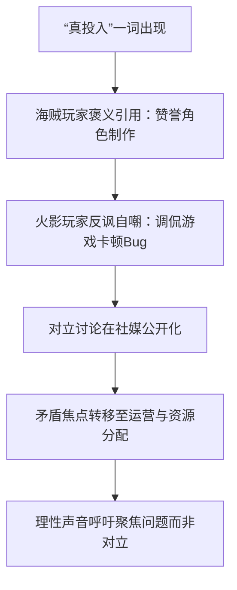

  

# 火影忍者手游对比海贼“真投入”事件舆情深度剖析研报

  

## 一、事件概述

  

本报告分析聚焦于《火影忍者手游》与《海贼王：壮志雄心》两款同属魔方工作室的手游玩家群体，因“真投入”一词引发的公开对立舆情。

  

事件起始于玩家在社交媒体（主要为抖音、B站）上对两款游戏进行对比，并迅速发酵。舆情样本总量约200条原创观点评论，整体情绪呈现显著分化与对抗性。其中，以自嘲戏谑（35%）与愤怒批评（25%）为主导的情绪占据总量六成，构成了舆情基调。

  

事件核心已超越对单一词汇的争论，演变为对游戏体验、运营策略及开发商资源分配公平性的集体性质疑。

  

---

  

## 二、事件时间线

  

  

### 图表说明

  

#### 1. 首次出处与语义分裂

  

“真投入”最初作为海贼玩家对游戏美术、角色还原度的正面评价出现（如B站弹幕“猿罗出品，就没差的”）。

  

随后，火影玩家将其挪用并反讽，用于自嘲游戏中的卡顿、操作失灵等体验问题：

  

> “真投入，敌人能动，我动不了。”

  

——抖音用户「夏烯」

  

至此，“真投入”完成了从褒义词到讽刺梗的语义异化。

  

#### 2. 关键转折与扩散

  

当“真投入”被用于跨游戏对比时：

  

> “海的最大贡献就是给火贡献了真投入。”

  

——抖音用户「小鼻嘎拌饭」

  

争论迅速被点燃并公开化。

  

双方从对比游戏手感、福利，逐步将矛头指向共同开发商魔方工作室，质疑其资源分配和运营策略，导致矛盾升级。

  

#### 3. 当前状态

  

在情绪对立的主流中，出现呼吁停止内耗、共同向运营方提建设性意见的声音：

  

> “都是玩家，我们要提意见让两款游戏蒸蒸日上，改把矛头指向策划，不是搞对立。”

  

——抖音用户「慢慢说」

  

但尚未改变舆情整体的对抗态势。

  

---

  

## 三、核心矛盾拆解

  

### 矛盾双方及核心诉求

  

#### 火影玩家阵营

  

##### 诉求一：抱怨体验下降，质疑资源被挪用

  

原文：

  

> “资源重心全在海贼上了，火影当然要不行了。”

  

——抖音用户「暖阳倾淤泥」

  

核心逻辑：

  

玩家认为开发资源向新项目倾斜，导致火影手游长期问题得不到解决。

  

##### 诉求二：强调玩法深度，反击贬低

  

原文：

  

> “海贼确实制作比火影好，福利也比火影好，但是就是没火影好玩。”

  

——抖音用户「人民」

  

核心逻辑：

  

制作水平不等于游戏体验，玩法深度才是长期竞争力。

  

---

  

#### 海贼玩家阵营

  

##### 诉求一：维护游戏质量评价

  

原文：

  

> “壮志雄心是我玩过最良心的游戏，没有之一。”

  

——抖音用户「無心」

  

核心逻辑：

  

希望游戏品质获得公平评价，而非因热度不足被否定。

  

##### 诉求二：反对恶意比较

  

原文：

  

> “感觉那些喷的没有一个是玩过的。”

  

——B站用户「LUFE菌」

  

核心逻辑：

  

认为部分批评源于刻板印象，而非真实体验。

  

---

  

### 深层矛盾

  

表面冲突：

  

- 火影：玩法更好

- 海贼：制作更强

  

真正冲突：

  

**同源竞争下的相对剥夺感与信任危机。**

  

当玩家发现两款游戏属于同一开发商时：

  

- 火影玩家认为自己被“抽血”

- 海贼玩家认为自己被“污名化”

  

于是游戏对比逐渐演变成：

  

> 对开发商资源分配公平性的审判。

  

---

  

## 四、信息环境与情绪分布

  

### 平台样本统计

  

| 项目 | 数据 |

|--------|--------|

| B站 | 3个视频，173条评论/弹幕 |

| 抖音 | 3个视频，170条评论 |

| 总有效样本 | 约200条 |

  

### 情绪分布

  

| 情绪类型 | 占比 |

|----------|------|

| 自嘲 / 戏谑 | 35% |

| 愤怒 / 批评 | 25% |

| 支持 / 辩护 | 20% |

| 理性分析 | 15% |

| 悲观 / 担忧 | 5% |

  

### 环境分析

  

| 维度 | 描述 |

|--------|--------|

| 情绪煽动者 | 存在使用“照抄”“造梗”等词汇扩大冲突的人群 |

| 理性声音 | 呼吁共同监督运营、停止内耗的声音存在但较弱 |

| KOL作用 | 无明显头部KOL，深度玩家承担意见领袖角色 |

  

---

  

## 五、社会背景与深层病灶

  

### 1. 被触碰的集体焦虑

  

#### 优质内容衰退焦虑

  

玩家担忧：

  

> 自己投入大量时间与金钱的游戏会因运营失误而衰落。

  

典型言论：

  

- “火影随时断气”

- “海贼肯定会海”

  

#### 厂商失责焦虑

  

玩家长期问题反馈得不到解决后：

  

会将不满升级为对厂商能力和诚意的全面质疑。

  

#### 投入不被看见焦虑

  

海贼玩家认为：

  

游戏品质较高，但长期得不到市场认可。

  

由此产生强烈辩护心理。

  

---

  

### 2. 暴露出的长期问题

  

#### 同源竞品运营的零和博弈困境

  

即使资源分配合理：

  

玩家仍倾向认为：

  

> 对方获得资源 = 自己被削弱。

  

形成长期信任陷阱。

  

#### 游戏评价体系情绪化

  

大量讨论停留在：

  

- 好玩 / 不好玩

- 良心 / 圈钱

  

缺少客观体验指标支撑。

  

#### 玩家反馈渠道失效

  

当正常反馈无法产生效果时：

  

玩家更倾向于在社交媒体公开宣泄。

  

最终形成公共舆情事件。

  

---

  

## 六、结论与演化推演

  

### 核心问题

  

本次舆情的本质并非：

  

> “真投入”到底是什么意思。

  

而是：

  

> 玩家对游戏体验的差异化感知，最终升级为对开发商资源分配公平性和运营能力的信任危机。

  

---

  

### 核心分歧

  

#### 火影玩家观点

  

问题根源：

  

> 资源被抽走 → 游戏体验恶化

  

#### 海贼玩家观点

  

问题根源：

  

> 制作投入被忽视 → 游戏价值被低估

  

---

  

### 后续影响讨论

  

当前讨论已经延伸至：

  

> 谁会先凉？

  

例如：

  

> “海贼要是出了白胡子还火不了的话，那这游戏就很难翻盘了。”

  

这种讨论本身已经反映出：

  

玩家对魔方长期运营能力缺乏信心。

  

---

  

### 当前证据池盲区

  

本报告基于公开社交媒体内容，存在以下局限：

  

1. 无法代表沉默的大多数玩家。

2. 缺乏官方留存率、流水等核心运营数据。

3. 无法验证“资源倾斜”等推测性观点。

4. 无法精确判断两款游戏真实用户规模变化。

  

---

  

### 最终判断

  

当前舆情状态：

  

**持续性阵营对立 + 情绪宣泄阶段。**

  

真正决定舆论走向的关键变量并非玩家争论本身，而是：

  

- 后续版本质量

- 运营策略调整

- 官方沟通能力

- 用户数据变化

  

若上述问题持续得不到回应，则“真投入”极有可能从一次玩梗事件，演变为长期绑定魔方工作室的负面舆论符号。