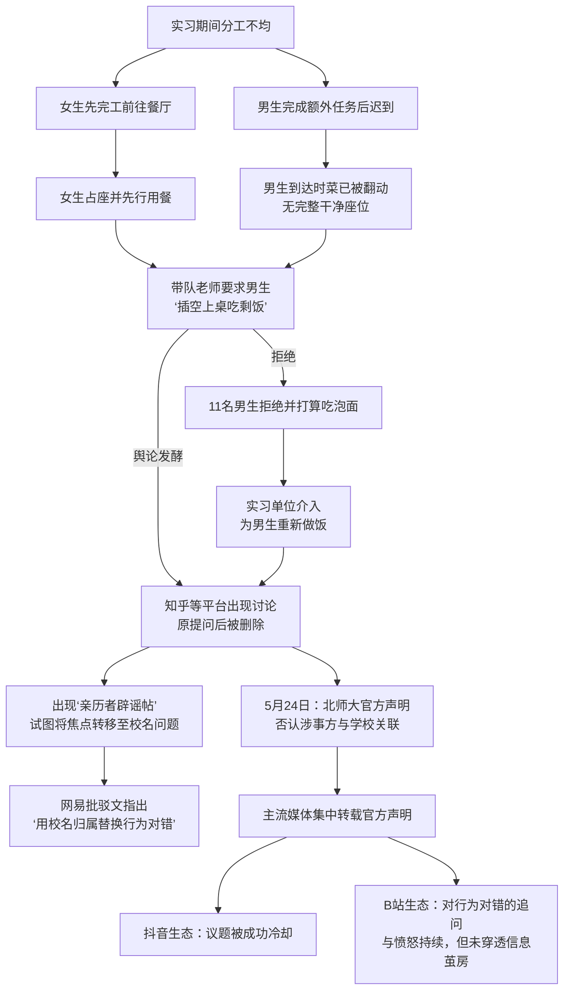

---
### 一、事件概述

本报告基于“北师大剩饭”事件的社媒与全网报道证据池，对事件进行结构化复盘。事件起因为一次校外实习期间的就餐安排冲突：11名男生因被分配额外任务而迟到，到达餐厅后，被带队老师要求与已先行用餐的女生“插空”同席，食用合餐制下已被翻动的菜肴。男生拒绝并计划改吃泡面，最终由实习单位为其重新备餐。事件经网络发酵后，北京师范大学于5月24日发布官方声明，澄清涉事师生及实习活动均与该校无关。

本案总体本量覆盖B站14个深度抓取视频及抖音46条相关视频。当前整体情绪呈现显著极化与平台分化：在B站等深度讨论社区，主流情绪为对当事老师行为失当的愤怒与对回应者傲慢态度的讽刺；而在抖音等大众传播平台，议题已被官方辟谣声明成功“冷却”与“定调”。

### 二、事件时间线

以下Mermaid时序图呈现了从事件发生到舆论定调的关键节点与因果链条。

**图表说明：**
1.  **事件源头**：分工不均与合餐制是根本诱因，首次出现在社媒情绪切片报告的事实节点描述中。
2.  **关键转折**：带队老师的指令直接触发了男生的集体拒绝，此行为被舆论定义为“压根不尊重人”——来源为B站用户评论。
3.  **舆论扩散与对抗性叙事**：原帖被删引发了“赛博史官”现象，而“亲历者辟谣帖”则试图将议题从“行为对错”转向“校名归属”，此举被网易批驳文《辟谣X 自供√》精准解码为一种话术替换。
4.  **最终分流**：北师大官方声明在大众媒体端完成了议题冷却，但在深度讨论社区并未平息对行为本身的愤怒，显示了鲜明的平台差异。

### 三、核心矛盾拆解

事件的矛盾可分为表层的当事人冲突与深层的舆论叙事之争。

| 矛盾方 | 核心诉求 | 引用原文 | 来源 |
|---|---|---|---|
| **一方：11名当事男生** | 拒绝在不被尊重的环境下用餐，维护基本尊严。 | “男生拒绝‘插空’上桌继续吃合餐中已被翻动过的菜” | 全网巡洋舰报告，事件核心情节 |
| **另一方：带队老师** | 在不调整座位或不重新备餐的前提下，让迟到的男生尽快“将就”用餐。 | 带队老师劝男生“进去吃点嘛，眼下吃饭重要”。 | 全网巡洋舰报告，事件核心情节 |
| **核心对冲叙事A：涉事方** | 将矛盾解释为因“社恐”、“贪小便宜”或“搞小团体”而发生的“不是什么大事”，并试图将公众注意力转移至“与北师大无关”。 | “该帖将事件定性为‘不是什么大事’‘双方各退一步解决了’，并将男生的拒绝归因于‘搞小团体’‘不熟坐一起不自在’‘男生吃得多怕A钱起冲突’。” | 全网巡洋舰报告，四-2，“亲历者辟谣帖”主张总结 |
| **核心对冲叙事B：批驳方** | 事件本质是组织管理失当导致的尊严问题，校名归属不能使行为本身合理化。 | “不管挂哪个学校的名，让11个人吃别人翻过的合餐剩菜都不合理。” | 全网巡洋舰报告，七-1，网易文观点转述 |

**诉求冲突分析：**
双方就“当下这一餐该如何解决”的诉求是根本对立的。男生方的拒绝对其自身而言无可妥协；而老师的指令则无视了合餐制下“翻剩菜”所隐含的卫生与尊重问题。更深层次的矛盾在于，事件折射出在集体活动中，当组织者（老师）缺乏基本的人际尊重和预案时，少数派群体（1:7的男生）的权益完全无法得到保障。

### 四、信息环境与情绪分布

以下表格呈现了基于证据池的情绪分布数据。此处仅作事实呈现，不对数据完整性作主观评估。

| 评估维度 | 平台/出处 | 有效样本量 | 情绪及占比（估算） |
|---|---|---|---|
| **深度讨论区** | B站 | 14个视频的弹幕/评论 | 愤怒/讽刺（约70%）> 男性权利觉醒叙事（约15%）> 事实澄清/辟谣（约10%）> 边缘/其他声音（约5%） |
| **大众传播区** | 抖音 | 46条视频 | 中性通报体（约100%）。所有视频均为官方媒体辟谣内容，评论区数据无法获取，但视频内容零观点交锋。 |
| **核心意见领袖** | 网易号「少爷写春秋」 | 1篇深度分析文 | 冷静批驳（100%）。对“亲历者辟谣帖”进行逐条逻辑拆解，阅读量极高，成为理性派意见的核心支撑。 |
| **对立叙事源头** | 百度贴吧/知乎 | 1篇“亲历者辟谣帖” | 维护与辩解（100%）。试图重构事件性质和归因，后被广泛批驳。 |

**环境分析：**
1.  **情绪煽动者**：事件中存在强烈的对抗性叙事。部分声音将男生拒绝行为纳入“男性权利觉醒”框架，如评论“饭桌的位置你不占领敌人就会占领”，强化了性别对立的叙事张力。
2.  **被淹没的理性声音**：尽管舆论极度情绪化，但以网易批驳文为代表的声音提供了高质量的逻辑分析。该文精准揭示了“用校名归属问题替换行为对错问题”这一核心话术机制，是舆论场中重要的“解码”力量，此类声音难以在短视频平台获得同等传播。
3.  **关键意见领袖角色**：知乎“北师大博士”的一万字回应非但没有平息争议，反而因其“不了解事实就发言”的态度，在B站弹幕和评论中引发了更强烈的讽刺与批判，扮演了激化矛盾的角色。

### 五、社会背景与深层病灶

此事件触碰了以下几个层面的集体焦虑：
1.  **基本人际尊重与礼仪的流失**：事件的核心愤怒点——“让一群人吃另一群人的合餐剩菜”，被广泛视为对个体尊严的无视。评论“家人吃饭都知道等人齐，更别提外人了”表明，公众将此视为一种社会基本礼节的失守，与学历、身份无关。
2.  **权力不对等下的组织管理失能**：事件暴露了在师生、上下级等权力结构中，管理者可能因缺乏同理心和预案，利用权力惯性对弱势方进行不合理的“将就”安排。这触动了公众对职场、高校等环境中非人性化管理的普遍反感。
3.  **性别议题的敏感场域**：事件被部分人迅速纳入“男性权利”叙事，并联想到北师大的“电梯事件”，反映了当前网络环境中，任何涉及性别分工差异的事件都可能成为性别对立的引爆点，使得原本关于“尊重”的普适讨论变得更加复杂和对立。

### 六、结论与演化推演

**核心问题与分歧在于：**
“行为对错”与“校名归属”被塑造为两个互斥的焦点。一方及官方声明将结论锁定在“非北师大”，从学校层面实现了风险切割；而另一方则坚持认为，无论行为主体是谁，让少数人吃翻动过的合餐剩菜这一事实本身，已构成对基本社交礼仪和个体尊严的侵犯，不应被成功“辟谣”。
**一个关键的正面事实被舆论忽略：** 实习单位作为第三方，在组织者失能后，“看不下去，另外给男生重新做了一份饭”。这一行为从侧面印证了该安排的不合理性，并提供了“常情常理的纠错力量”这一现实解决方案的样本。
**演化推演：**
根据证据池呈现的规律，该事件的后续讨论将大概率分化为：
1.  **被动冷却**：随着北师大声明被主流媒体广泛采用，大众层面的讨论已基本定调为“谣言澄清”，热度将随时间自然衰减。
2.  **主动记忆**：在B站等深度讨论社区，此事件将作为“不尊重他人”的典型案例，与“电梯事件”等共同构成关于特定文化的集体记忆标签，在类似事件发生时被反复调用与复盘。