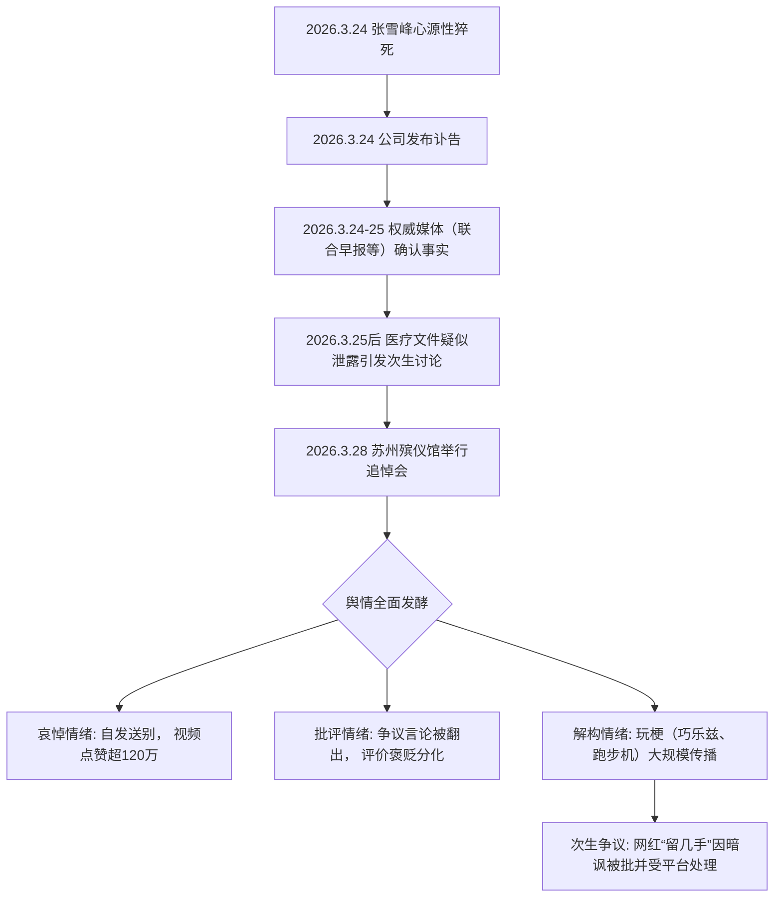

## 一、事件概述

2026年3月24日，知名考研辅导讲师、网络红人张雪峰（本名张子彪）因心源性猝死逝世，享年41岁。该事件在B站、抖音等社交平台引发广泛关注与讨论。根据对平台抓取数据的交叉验证，事件相关讨论视频超过92个，其中B站深度抓取的6个代表性视频累计播放量超过7.7万次，抖音平台单条讣告视频点赞超120万。网络评价呈现显著的**褒贬分化**与**玩梗化**特征，悼念、批评、解构三种情绪形态交织，整体舆情光谱复杂。

## 二、事件时间线与舆情演化路径

基于证据池中多来源信息梳理，事件发展与舆情发酵的关键节点如下：

**文字说明**：

1. **事实确认与扩散**：逝世消息于3月24日晚通过公司讣告首发，迅速被联合早报、维基百科等国内外权威信源交叉验证，构成舆情基础事实层。
    
2. **转折与分化**：追悼会的盛大举行与医疗隐私泄露事件，将公众情绪从单一的“惊愕与惋惜”导向“褒贬分化”与“社会治理”讨论。支持者援引追悼会规模与“打破信息差”的功绩，反对者则集中援引其历史争议言论（如“文科都是服务业”）进行批评。
    
3. **核心发酵特征——玩梗化**：情绪核心从早期的悼念，显著转向对其生前“推崇吃苦、高强度运动”等标签的解构，衍生出“巧乐兹梗”、“跑步机梗”、“牢峰”等亚文化符号，其传播模式被类比为“科比冰红茶梗”。
    
4. **官方与平台角色**：平台与监管的过往动作（如2025年12月因不当言论被封禁）及事件后对网红“留几手”的处理，为舆论场划定了隐形的讨论边界。
    

## 三、核心矛盾拆解

舆情中的对立并非简单的“支持与反对”，而是围绕其公共身份与遗产的多维价值判断冲突。

### 矛盾双方与核心诉求

|矛盾方|核心诉求（基于证据池原文）|来源|
|:--|:--|:--|
|**支持者/悼念者**|**承认其“打破信息差”的功绩**“打破大众信息差…在大众传播领域做到这种体量就是值得尊重的。”|[B站视频4评论]|
|**反对者/批评者**|**批判其功利主义教育观及具体误导**“土木牲囗报道，他当初推我去智能建造[笑哭]”。“南方网发表文章批评张雪峰的教育指导充满极端功利主义色彩…严重侵蚀国家科技创新的根基。”|[B站视频4评论]；[深度分析报告]|
|**玩梗者/解构者**|**消解权威，宣泄内卷压力**“年轻人借着玩梗，抒发日常学业、职场内卷带来的疲惫，表达对过度竞争的抵触。”|[深度分析报告]|

### 冲突不可调和性分析

双方诉求存在根本性分歧：支持者视其为**特定信息壁垒下的“实用主义救星”**，反对者则视其为**危害长期发展的“功利主义推手”**。这种冲突根植于中国社会在**教育筛选功能与育人本质**、**短期就业导向与长期创新能力培养**之间的深层制度性张力。玩梗者的出现，则标志着对“努力-成功”单一叙事的集体性反思与消解，是前两种严肃立场之外的第三条情绪路径。

## 四、信息环境与情绪分布

### 基于平台抓取数据的有效样本情绪分析

|平台|分析样本概述|主要情绪类型（估算占比）|说明|
|:--|:--|:--|:--|
|**B站**|深度分析6个视频，涵盖评论、弹幕。|**悼念与反思 (~40%)** **批评与解构 (~50%)** **流量收割 (~10%)**|批评与玩梗内容更易引发互动与二创；标题含“内卷反思”的视频播放量最高。|
|**抖音**|抓取50个视频元数据（**未获取评论区数据**）。|**正向悼念与报道 (~70%)** **争议与次生事件 (~30%)**|高赞视频多来自官方新闻媒体；“寒门救星”与“争议人物”标签并存；网红“留几手”事件引发次生关注。|

### 信息环境特征

1. **情绪煽动者与理性声音**：存在明确的情绪煽动案例（如网红“留几手”因暗讽被批）。同时，**被淹没的理性声音**客观存在，如B站评论区对“张雪峰方法论对学习能力普通者的适用性”的探讨。
    
2. **KOL与创作者角色**：关键意见领袖（KOL）和内容创作者是情绪放大与议题设置的关键节点。他们不仅传播信息，更通过二次创作（八字分析、行业反思视频）将事件纳入更广的社会议题讨论框架。
    
3. **平台算法效应**：平台的内容分发机制客观上助推了争议性和情绪化内容的传播，使得玩梗、批评等更具冲突性的内容获得更高可见度。
    

## 五、社会背景与深层病灶

1. **教育内卷与路径焦虑**：在“寒门难出贵子”的普遍认知下，公众对“信息差”极度敏感。张雪峰作为“信息差”的拆解者与提供者，其去世直接触及了家庭对教育投资不确定性、上升通道狭窄的深层恐惧。
    
2. **健康与成功的价值悖论**：“心源性猝死”的直接诱因与“长期高强度工作”、“倡导拼命内卷”的标签形成残酷对照，迫使公众审视“996”文化与“奋斗至上”伦理对个体生命的侵蚀，引发了关于**成功代价**的广泛反思。
    
3. **权威解构与意义感危机**：年轻群体通过玩梗解构“奋斗导师”的权威形象，反映了对传统成功学叙事的幻灭与反抗。这不仅是网络亚文化的体现，更是**代际间价值观念断裂**与**意义感危机**的征兆。
    
4. **信息公开与隐私保护的冲突**：医疗文件泄露事件虽非舆论主流，但触及了名人身后、公民个人信息保护与公共信任的严肃议题，暴露了相关机制的脆弱性。
    

## 六、结论与演化推演

### 核心问题与分歧

本次舆情的核心已从对张雪峰个人的功过评价，演化为对以下三个公共议题的辩论：

1. **在教育领域，应推崇怎样的成功观？**  
    （“实用主义” vs. “长期主义”）
    
2. **在社会层面，应如何看待并回应内卷文化？**  
    （“个体奋斗” vs. “结构反思”）
    
3. **在技术层面，网络亚文化解构公共事件的边界何在？**  
    （“娱乐自由” vs. “尊重底线”）
    

### 客观存在的后续讨论

据证据池显示，已有观点将此事与**特定行业（如半导体）的内卷现状**关联讨论（视频3），表明事件已超越个人范畴，成为讨论系统性问题的**符号载体**。同时，围绕其生前言论是否“误导”学生的争论仍在持续，这与其教育理念的功利主义底色直接相关，短期内难以达成共识。

### 总体结论

**总体而言，张雪峰逝世事件作为一块社会“棱镜”，折射出教育、健康、价值观念等多重领域的结构性矛盾。舆情中的褒贬与玩梗，是不同群体基于自身经历与立场，对这些矛盾进行解读、宣泄与试图重新建构意义的外在表现。**