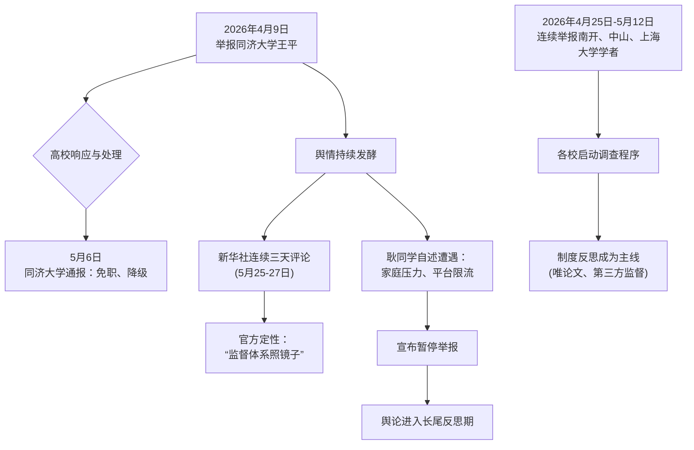

**一、事件概述**
2026年4月至5月，退学博士生“耿同学”（耿洪伟）通过社交媒体实名举报同济大学、南开大学等多所985高校院长、杰青级学者在《Nature》及其子刊上的论文数据造假。事件核心成果为同济大学对涉事院长做出免职、降级等严厉处理。舆情整体呈现高支持度（支持赞扬情绪占比主流）、强反思性、伴随显著担忧与部分质疑的复杂特征。官方媒体（新华社）以罕见连续评论介入，将事件定性为对学术监督体系的“照镜子”。

**二、事件时间线**

*   **逻辑链条说明**：事件始于耿同学4月9日对同济大学教授的举报。高校的处理结果（同济大学5月6日通报）成为舆情第一个高潮点，证实举报有效性。随后的连续举报维持热度。5月下旬，新华社的连续评论是官方舆论引导的关键转折，将事件从个案提升至制度反思高度。与此同时，耿同学个人声明遭遇家庭压力与平台限流，并宣布暂停举报，引发舆论场对其个人境遇的广泛担忧，舆情结构由此复杂化。事件最终进入以制度讨论为主的长尾阶段。

**三、核心矛盾拆解**
1.  **主要矛盾双方**：举报者（耿同学及支持其的公众舆论） vs. 现有学术评价与监督体系（及其背后的利益关联方）。
2.  **双方核心诉求**：
    *   **举报方诉求**：严惩学术不端，改革“唯论文”评价体系，建立透明、独立的第三方学术监督与举报人保护机制。
        *   *证据引用*：“打假治不了学术不端的根本问题”——耿同学（抖音）；“学术打假 不能只靠‘孤勇者’！”——看看新闻Knews（抖音）。
    *   **体系相关方诉求**（表现为舆论中的质疑与风险规避）：维护学术界表面稳定，防止“选择性打假”或恶意攻击；部分观点质疑举报者动机，担忧事件引发连锁反应。
        *   *证据引用*：“造谣不怕号没了吗”、“靠这个赚钱的”——B站评论；“担心出现‘法不责众’现象”——耿同学自述暂停原因（抖音）。
3.  **不可调和性与背景**：矛盾具有结构性。举报行为直接冲击了由论文、帽子、项目构成的学术资源分配核心链条，触动了既有利益格局。其背后的深层背景是“五唯”（唯论文等）评价体系长期存在导致的异化，以及高校内部学术监督机制的形同虚设。新华社评论“专业机构为何没能早一点发现”点明了制度失灵的关键。

**四、信息环境与情绪分布**

| 平台 | 有效样本特征 | 主要情绪分布（估计比例） | 关键意见领袖/机构角色 |
| :--- | :--- | :--- | :--- |
| **抖音** | 视频数量多(46)，主流媒体参与度极高，点赞量巨大。 | **支持赞扬(60%)**、制度反思(25%)、担忧(10%)、其他(5%) | **大众日报、新华社**等央媒是核心信息源与情绪定调者，将事件导向制度反思。 |
| **B站** | 视频数量多(42)，弹幕、评论互动极强，观点交锋激烈。 | **支持赞扬(40%)**、担忧(25%)、质疑(15%)、制度反思(15%)、玩梗(5%) | 知名UP主、普通用户共同构成多元讨论场。质疑声音在此平台相对更集中。 |
| **总体** | 跨平台互动量巨大，全网播放量超2亿。 | 支持与制度反思构成绝对主流，担忧情绪显著，质疑声音存在但非主导。 | 官媒主导建设性方向，民间情绪复杂多元，存在试图放大安全风险的煽动性内容（如“最后告白”等标题）。 |

**环境分析**：
*   **情绪煽动者**：部分自媒体使用夸张标题（如“杀疯了的耿同学到了最危险时候!”、“新华社40分钟专访，成最后告白？”）存在将事件渲染为个人生死对决、放大恐慌情绪的倾向。
*   **被淹没的声音**：聚焦具体制度建设（如建立内部举报通道）的理性讨论，在情绪化弹幕和玩梗文化中容易被淹没。
*   **关键意见领袖**：官方媒体（新华社等）成功将舆论焦点从“个人英雄”引向“制度缺失”，扮演了**议程设置者**和**理性引导者**的关键角色。

**五、社会背景与深层病灶**
1.  **集体焦虑的触碰**：
    *   **对学术公平的信任危机**：顶尖学者造假，动摇了公众对知识权威和科研成果的信任基础。
    *   **对“努力无用论”的恐惧**：当“造假捷径”能获得顶级资源和地位时，遵守规则者的努力显得苍白，加剧了“劣币驱逐良币”的社会焦虑。
    *   **对内部申诉渠道失效的绝望**：事件反证了依靠机构内部监督的困难，迫使个人选择“网络曝光”这种高风险的外部监督方式。
2.  **暴露的长期问题**：
    *   **“唯论文”评价体系的结构性弊端**：将论文数量、期刊等级与个人晋升、资源分配强绑定，是催生学术不端的根本制度诱因。
    *   **学术共同体的自我监督失灵**：学术委员会、同行评议、期刊审核等“守门人”机制未能有效发挥作用，甚至可能存在共谋或沉默。
    *   **举报人保护制度的缺位**：耿同学面临的家庭压力、平台限流传闻，映射出学术举报者缺乏有效制度性保护，全凭个人勇气承担巨大风险。

**六、结论与演化推演**
*   **核心问题与分歧**：事件的核心分歧已从“是否造假”的事实层面，演变为“如何根治”的**路径分歧**。一派主张依靠“孤勇者”式的个案清理，另一派（包括官方媒体与耿同学本人）主张必须进行系统性制度改革。
*   **后续影响的讨论**：证据池显示，舆论已关注到事件可能产生的长远影响。积极方面，有导师开始向学生索要原始数据；消极方面，存在担忧事件可能加剧学术圈内部信任危机，或使正常科研环境变得更加紧张。关于“平台限流”的讨论，则指向了社交平台在涉及重大公共利益事件时的**治理责任与公信力**问题。
*   **演化推演（基于事实）**：舆情热度已进入以制度讨论为主的长尾期。但若以下情况发生，事件可能再度引爆：1）耿同学或类似举报人出现明确的人身安全受侵害事件；2）被举报高校的后续调查结果严重背离公众预期；3）出现更多实证表明平台存在不合理的干预行为。事件的终极影响，取决于它能否实质性推动“唯论文”评价体系的改革和独立学术监督机制的落地。
